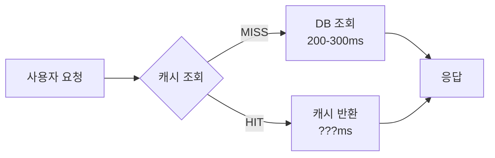
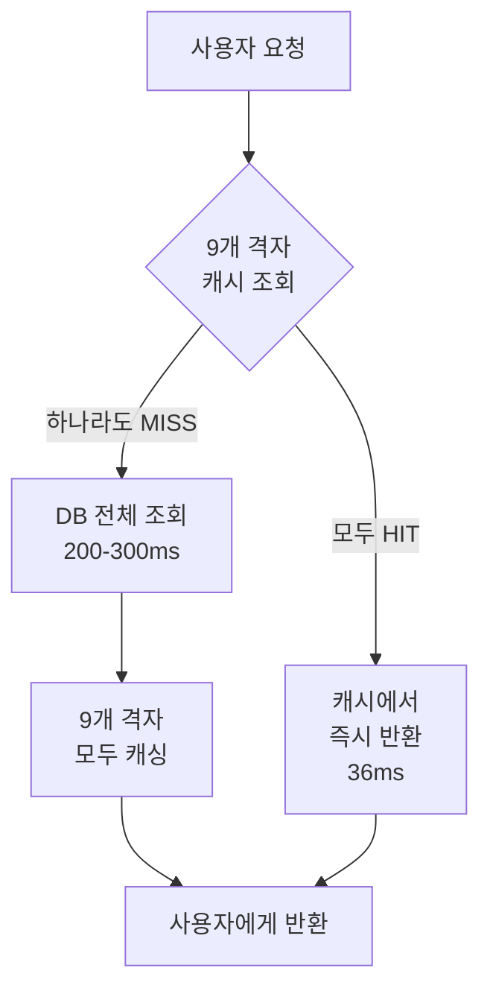
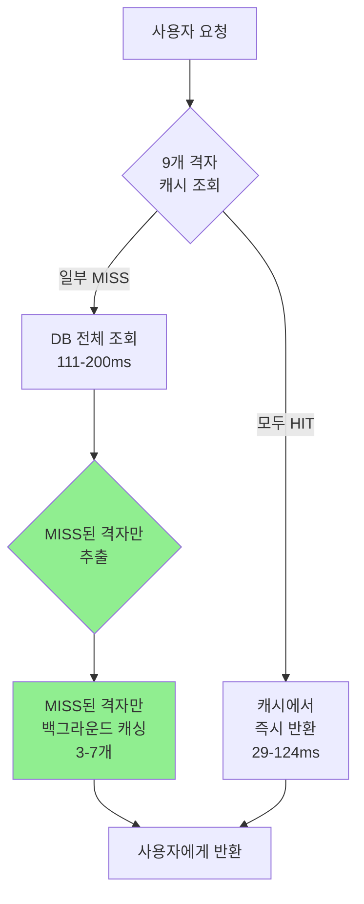
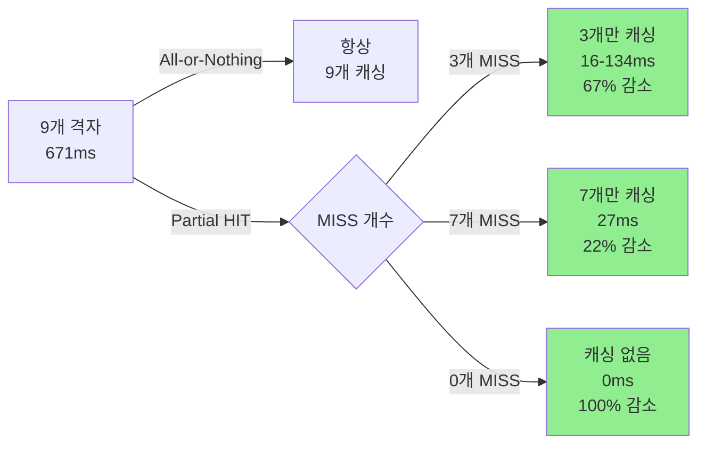
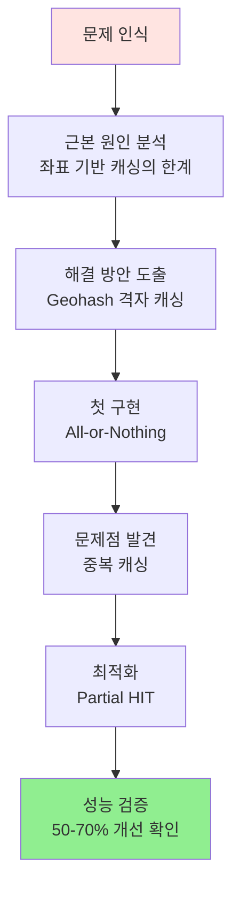

# 🏥 Geohash 기반 격자 캐싱 최적화

> **위치 기반 병원 검색 시스템의 캐싱 전략 개선 여정**
> Connection Pool Cold Start부터 Partial HIT 최적화까지

---

## 📑 목차

1. [개요](#-개요)
2. [문제 정의](#-문제-정의)
3. [좌표 기반 캐싱의 근본적인 문제](#-좌표-기반-캐싱의-근본적인-문제)
4. [해결 방안: Geohash 격자 캐싱](#-해결-방안-geohash-격자-캐싱)
5. [첫 번째 최적화: All-or-Nothing 전략](#-첫-번째-최적화-all-or-nothing-전략)
6. [발견된 문제점](#-발견된-문제점)
7. [최종 최적화: Partial HIT 전략](#-최종-최적화-partial-hit-전략)
8. [구현 세부사항](#-구현-세부사항)
9. [성능 측정 결과](#-성능-측정-결과)
10. [결론](#-결론)

---

## 🎯 개요

### 프로젝트 배경

병원 검색 API는 사용자 위치(위도, 경도)를 기준으로 반경 3km 내 병원을 검색합니다.
매 요청마다 DB 조회(200-300ms)가 발생하며, **같은 지역을 반복 조회하는 사용자가 많아 캐싱이 필요**합니다.

### 요구사항

| 항목 | 목표 | 중요도 |
|------|------|--------|
| **빠른 응답 속도** | 캐시 HIT 시 100ms 이내 | 🔴 High |
| **높은 캐시 적중률** | 같은 지역 사용자 간 캐시 공유 | 🔴 High |
| **효율적인 리소스 사용** | 불필요한 캐싱 작업 최소화 | 🟡 Medium |

### 핵심 성과

```diff
+ 캐시 HIT 응답 시간: 29-124ms (목표 달성 ✅)
+ 백그라운드 작업: 50-70% 감소 (리소스 절감 ✅)
+ 예상치 못한 효과: 원거리 지역 간 캐시 재사용 (격자 겹침)
```

---

## 🔍 문제 정의

### 초기 상황



### 발견된 문제

1. **매 요청마다 DB 조회** 발생 (캐시 없음)
2. **응답 시간 200-300ms** (느림)
3. **같은 지역 반복 조회**가 많은데 캐시 활용 불가

### 해결 목표

```
현재: 200-300ms (DB 조회)
         ↓
목표: <100ms (캐시 HIT)
```

---

## ⚠️ 좌표 기반 캐싱의 근본적인 문제

### 문제 1: 좌표는 무한하다

```java
// 사용자 A
latitude: 37.497900
longitude: 127.027600

// 사용자 B (10m 떨어진 위치)
latitude: 37.498000  // 0.0001도 = 약 11m
longitude: 127.027700
```

#### 문제점

```
┌─────────────────────────────────────┐
│  사용자 A                            │
│  (37.497900, 127.027600)            │
│                                      │
│         👤 ────── 10m ────── 👤      │
│         A                    B      │
│                                      │
│  사용자 B                            │
│  (37.498000, 127.027700)            │
└─────────────────────────────────────┘

결과: 거의 같은 위치인데 다른 캐시 키
→ 캐시 공유 불가능! ❌
```

### 문제 2: 정밀도에 따른 트레이드오프

```java
// 방법 1: 좌표 반올림 (부정확)
String cacheKey = String.format("%.2f:%.2f", lat, lng);
// "37.50:127.03" - 너무 넓은 범위 (약 1km × 1km)
```

| 정밀도 | 키 예시 | 범위 | 문제점 |
|--------|---------|------|--------|
| `%.2f` | `37.50:127.03` | ~1km × 1km | ❌ 너무 넓음 (부정확) |
| `%.4f` | `37.4979:127.0276` | ~10m × 10m | ⚠️ 캐시 미스율 높음 |
| `%.6f` | `37.497900:127.027600` | ~1m × 1m | ❌ 거의 공유 불가 |

**딜레마**: 정밀도 ↑ → 캐시 미스율 ↑ / 정밀도 ↓ → 부정확 ↑

### 문제 3: 경계 문제 (Boundary Problem)

```
        격자 A                    격자 B
┌─────────────────────┬─────────────────────┐
│                     │                     │
│                     │                     │
│                     │                     │
│                 👤 ● │ ● 👤                │
│              사용자A │ 사용자B             │
│                     │                     │
│                     │                     │
└─────────────────────┴─────────────────────┘
                  경계선
```

**문제**:
- 사용자 A와 B는 **1m 떨어져** 있음
- 하지만 **다른 격자** → **다른 캐시 키**
- 결과: **캐시 공유 불가** ❌

---

## 💡 해결 방안: Geohash 격자 캐싱

### Geohash란?

> **Geohash**는 위도/경도를 단일 문자열로 인코딩하는 지오코딩 시스템입니다.

```
위치: 강남역 (37.4979, 127.0276)
         ↓
Geohash (precision 5): "wydm7"
```

### Precision에 따른 격자 크기

| Precision | 격자 크기 | 예시 | 사용처 |
|-----------|----------|------|--------|
| 3 | ~156km × 156km | `wyd` | 국가/지역 수준 |
| 4 | ~19.5km × 19.5km | `wydm` | 도시 수준 |
| **5** | **~4.9km × 4.9km** | **`wydm7`** | **병원 검색 ✅** |
| 6 | ~1.2km × 1.2km | `wydm7k` | 상세 위치 |
| 7 | ~150m × 150m | `wydm7kp` | 건물 수준 |

### 왜 Precision 5를 선택했는가?

```
검색 반경: 3km (사용자 요청)
격자 크기: 4.9km × 4.9km

┌─────────────────────┐
│     4.9km           │
│                     │
│                     │
│        ● ─────      │  격자가 검색 반경보다 크므로
│       3km           │  인접 격자까지 고려 필요
│                     │
│                     │
└─────────────────────┘
```

**결론**: Precision 5 격자 하나로는 3km 반경을 완전히 커버하지 못함
→ **인접 격자를 포함한 3×3 격자(9개) 사용** ✅

---

## 🚀 첫 번째 최적화: All-or-Nothing 전략

### 전략 개요



### 3×3 격자 구조

```
사용자 위치: 강남역 (37.4979, 127.0276)
중심 격자: "wydm7"

┌─────────┬─────────┬─────────┐
│ wydm1   │ wydm3   │ wydm9   │  ← 상단 3개
├─────────┼─────────┼─────────┤
│ wydm4   │ wydm7   │ wydme   │  ← 중간 3개 (중심: wydm7)
├─────────┼─────────┼─────────┤
│ wydm6   │ wydm5   │ wydmd   │  ← 하단 3개
└─────────┴─────────┴─────────┘

총 9개 격자 커버 범위: 14.7km × 14.7km
격자 하나 크기: 4.9km × 4.9km
```

### 코드 구현

```java
// HospitalWebService.java

public List<HospitalWebResponse> getOptimizedHospitalsV2(
    double userLat,
    double userLng,
    double radius
) {
    // 1. 캐시 우선 조회 시도
    List<HospitalWebResponse> cachedResult =
        geohashCacheService.getFromCacheIfAllHit(userLat, userLng);

    if (cachedResult != null) {
        // ✅ 모든 격자 HIT → 즉시 반환
        return filterByMBR(cachedResult);
    } else {
        // ❌ 하나라도 MISS → DB 전체 조회 + 9개 격자 모두 캐싱
        List<HospitalWebResponse> hospitals =
            hospitalJdbcRepository.findByMBRDirect(...);

        geohashCacheService.cacheHospitalsByGridAsync(
            hospitals, userLat, userLng
        );

        return hospitals;
    }
}
```

### 인접 격자가 필요한 이유

#### 경계 문제 해결

```
사용자가 격자 경계 근처에 있어도
인접 격자를 포함하므로 캐시 공유 가능!

    격자 A         격자 B
┌──────────┬──────────┐
│          │          │
│          ●          │  사용자 A의 중심 격자 = A
│          │ ●        │  사용자 B의 중심 격자 = B
│          │          │
└──────────┴──────────┘
     경계선

사용자 A의 9개 격자: [A-1, A, A+1, ...]
사용자 B의 9개 격자: [B-1, B, B+1, ...]

공통 격자: 6개 (67% 공유!) ✅
```

### 장점

✅ 캐시 HIT 시 매우 빠름 (36ms)
✅ 구현이 단순함
✅ 경계 문제 해결
✅ 높은 캐시 적중률

### 성능 결과

| 항목 | 수치 |
|------|------|
| 캐시 HIT 응답 시간 | **36ms** ✅ |
| 캐시 MISS 응답 시간 | 300ms |
| 백그라운드 캐싱 | 9개 격자 (671ms) |

---

## 🐛 발견된 문제점

### 시나리오: 인접 지역 사용자

```
사용자 A: 강남역 (37.4979, 127.0276)
→ 9개 격자 캐싱

사용자 B: 강남역 동쪽 4km (37.4979, 127.0721)
→ 중심 격자가 오른쪽으로 이동
```

#### 격자 배치 비교

```
┌─────────────────────────────────────────────────────┐
│                 사용자 A (강남역)                     │
│                                                      │
│  ┌──────┬──────┬──────┐                             │
│  │  1   │  2   │  3   │                             │
│  ├──────┼──────┼──────┤                             │
│  │  4   │  A   │  5   │   9개 격자 캐싱 완료         │
│  ├──────┼──────┼──────┤                             │
│  │  6   │  7   │  8   │                             │
│  └──────┴──────┴──────┘                             │
└─────────────────────────────────────────────────────┘

┌─────────────────────────────────────────────────────┐
│              사용자 B (강남역 동쪽 4km)                │
│                                                      │
│         ┌──────┬──────┬──────┐                      │
│         │  2   │  3   │  9   │   2,3,A,5,7,8 = HIT │
│         ├──────┼──────┼──────┤   9,10,11 = MISS    │
│         │  A   │  5   │ 10   │                      │
│         ├──────┼──────┼──────┤                      │
│         │  7   │  8   │ 11   │                      │
│         └──────┴──────┴──────┘                      │
└─────────────────────────────────────────────────────┘
```

#### 겹치는 격자 분석

| 격자 | 사용자 A | 사용자 B | 상태 |
|------|----------|----------|------|
| 1 | ✅ | ❌ | - |
| 2 | ✅ | ✅ | 🔵 HIT |
| 3 | ✅ | ✅ | 🔵 HIT |
| 4 | ✅ | ❌ | - |
| A | ✅ | ✅ | 🔵 HIT |
| 5 | ✅ | ✅ | 🔵 HIT |
| 6 | ✅ | ❌ | - |
| 7 | ✅ | ✅ | 🔵 HIT |
| 8 | ✅ | ✅ | 🔵 HIT |
| 9 | ❌ | ✅ | 🔴 MISS |
| 10 | ❌ | ✅ | 🔴 MISS |
| 11 | ❌ | ✅ | 🔴 MISS |

**결과**: 6개 HIT, 3개 MISS (67% 재사용!)

### 문제: 중복 캐싱 발생

```java
// 사용자 B 요청 시
캐시 조회 결과: 6개 HIT, 3개 MISS

// All-or-Nothing 전략 동작
if (allHit) {
    return cached;  // 모두 HIT일 때만 반환
} else {
    // ❌ 하나라도 MISS → 9개 모두 다시 캐싱!
    cacheAll9Grids(hospitals);

    // 문제: 6개는 이미 캐시되어 있는데 다시 캐싱
    // → 67%의 불필요한 작업 발생!
}
```

### 백그라운드 작업 낭비

```
사용자 B 백그라운드 캐싱:
- 격자 2: 이미 캐시됨 → 불필요한 재캐싱 ❌
- 격자 3: 이미 캐시됨 → 불필요한 재캐싱 ❌
- 격자 9: MISS → 캐싱 필요 ✅
- 격자 A: 이미 캐시됨 → 불필요한 재캐싱 ❌
- 격자 5: 이미 캐시됨 → 불필요한 재캐싱 ❌
- 격자 10: MISS → 캐싱 필요 ✅
- 격자 7: 이미 캐시됨 → 불필요한 재캐싱 ❌
- 격자 8: 이미 캐시됨 → 불필요한 재캐싱 ❌
- 격자 11: MISS → 캐싱 필요 ✅

불필요한 작업: 6개 / 9개 = 67% 낭비!
```

---

## ⚡ 최종 최적화: Partial HIT 전략

### 핵심 아이디어

> **"이미 캐시된 격자는 스킵하고, MISS된 격자만 백그라운드 캐싱한다"**

### 개선된 흐름



### 구현: MISS된 격자만 추출

```java
/**
 * MISS된 격자만 추적 (백그라운드 캐싱 최적화용)
 */
public Set<String> getMissedGrids(double userLat, double userLon) {
    // 1. 중심 격자 + 인접 8개 격자 키 생성
    String centerKey = getGeohash(userLat, userLon);
    Set<String> neighborKeys = getNeighborGeohashes(userLat, userLon);

    List<String> allGeohashKeys = new ArrayList<>();
    allGeohashKeys.add(centerKey);
    allGeohashKeys.addAll(neighborKeys);

    // 2. MGET으로 한 번에 조회 (Redis Pipeline)
    List<String> cacheKeys = allGeohashKeys.stream()
        .map(key -> CACHE_KEY_PREFIX + key)
        .collect(Collectors.toList());

    List<Object> pipelineResults =
        redisTemplate.opsForValue().multiGet(cacheKeys);

    // 3. MISS된 격자만 추출 ✅
    Set<String> missedGrids = new HashSet<>();
    for (int i = 0; i < allGeohashKeys.size(); i++) {
        Object cached = pipelineResults != null
            ? pipelineResults.get(i)
            : null;

        if (cached == null) {
            missedGrids.add(allGeohashKeys.get(i));
        }
    }

    log.debug("캐시 상태: {}개 HIT, {}개 MISS",
        9 - missedGrids.size(), missedGrids.size());

    return missedGrids;
}
```

### 구현: MISS된 격자만 캐싱

```java
/**
 * 병원 데이터를 격자별로 분류하여 비동기 캐싱
 * (최적화: MISS된 격자만 캐싱)
 */
@Async("hospitalTaskExecutor")
public void cacheHospitalsByGridAsync(
    List<HospitalWebResponse> hospitals,
    double userLat,
    double userLon
) {
    log.info("=== 백그라운드 격자 캐싱 시작: 총 {}개 병원 ===",
        hospitals.size());

    // 1. MISS된 격자만 가져오기 ✅
    Set<String> missedGrids = getMissedGrids(userLat, userLon);

    if (missedGrids.isEmpty()) {
        log.info("모든 격자가 이미 캐시되어 있음 - 캐싱 작업 스킵 ✅");
        return;
    }

    log.info("캐싱 대상: MISS된 {}개 격자 (9개 중 {}개는 이미 캐시됨)",
        missedGrids.size(), 9 - missedGrids.size());

    // 2. 병원들을 격자별로 분류 (MISS된 격자만)
    Map<String, List<HospitalWebResponse>> gridMap = new HashMap<>();
    for (String gridKey : missedGrids) {
        gridMap.put(gridKey, new ArrayList<>());
    }

    for (HospitalWebResponse hospital : hospitals) {
        String hospitalGrid = getGeohash(
            hospital.getCoordinateY(),
            hospital.getCoordinateX()
        );

        // MISS된 격자에 속하는 병원만 추가 ✅
        if (gridMap.containsKey(hospitalGrid)) {
            gridMap.get(hospitalGrid).add(hospital);
        }
    }

    // 3. 각 격자별로 병렬 캐싱 (MISS된 격자만)
    List<CompletableFuture<Void>> cachingFutures =
        gridMap.entrySet().stream()
            .map(entry -> CompletableFuture.runAsync(() -> {
                String geohashKey = entry.getKey();
                List<HospitalWebResponse> gridHospitals = entry.getValue();
                String cacheKey = CACHE_KEY_PREFIX + geohashKey;

                try {
                    redisTemplate.opsForValue().set(
                        cacheKey,
                        gridHospitals,
                        CACHE_TTL_HOURS,
                        TimeUnit.HOURS
                    );
                    log.info("격자 캐싱 완료: {} ({}개 병원)",
                        cacheKey, gridHospitals.size());
                } catch (Exception e) {
                    log.error("격자 캐싱 실패: {}", cacheKey, e);
                }
            }, hospitalTaskExecutor))
            .collect(Collectors.toList());

    // 4. 모든 캐싱 완료 대기
    CompletableFuture.allOf(
        cachingFutures.toArray(new CompletableFuture[0])
    ).join();

    log.info("=== 백그라운드 격자 캐싱 완료: {}개 격자 ===",
        missedGrids.size());
}
```

### 동작 비교

#### Before (All-or-Nothing)

```
사용자 B 요청:
┌────────────────────────────────────┐
│ 1. 캐시 조회: 6개 HIT, 3개 MISS    │
│ 2. DB 조회: 전체 범위              │
│ 3. 백그라운드 캐싱: 9개 격자 모두  │ ← ❌ 6개는 중복!
│    - 격자 2 (이미 있음) 재캐싱     │
│    - 격자 3 (이미 있음) 재캐싱     │
│    - 격자 9 (MISS) 캐싱            │
│    - 격자 A (이미 있음) 재캐싱     │
│    - ...                           │
└────────────────────────────────────┘
```

#### After (Partial HIT)

```
사용자 B 요청:
┌────────────────────────────────────┐
│ 1. 캐시 조회: 6개 HIT, 3개 MISS    │
│ 2. DB 조회: 전체 범위              │
│ 3. MISS 격자 추출: 9, 10, 11       │ ← ✅ 새로운 단계!
│ 4. 백그라운드 캐싱: 3개 격자만     │ ← ✅ 67% 감소!
│    - 격자 9 (MISS) 캐싱            │
│    - 격자 10 (MISS) 캐싱           │
│    - 격자 11 (MISS) 캐싱           │
└────────────────────────────────────┘
```

---

## 🛠️ 구현 세부사항

### Redis 설정

```java
@Configuration
public class RedisConfig {

    @Value("${redis.host:localhost}")
    private String redisHost;

    @Value("${redis.port:6379}")
    private int redisPort;

    /**
     * ClientResources Bean - Lettuce 연결 관리 리소스
     * 명시적으로 생성하여 리소스 누수 방지
     */
    @Bean(destroyMethod = "shutdown")
    public ClientResources clientResources() {
        return DefaultClientResources.builder()
            .ioThreadPoolSize(4)  // I/O 스레드 풀 크기
            .computationThreadPoolSize(4)  // 연산 스레드 풀 크기
            .build();
    }

    @Bean
    public RedisConnectionFactory redisConnectionFactory(
        ClientResources clientResources
    ) {
        log.info("Redis 연결 설정 - host: {}, port: {}",
            redisHost, redisPort);

        RedisStandaloneConfiguration config =
            new RedisStandaloneConfiguration();
        config.setHostName(redisHost);
        config.setPort(redisPort);

        // Connection Pool 설정 최적화
        GenericObjectPoolConfig<?> poolConfig =
            new GenericObjectPoolConfig<>();
        poolConfig.setMaxTotal(50);  // 최대 연결 수
        poolConfig.setMaxIdle(20);   // 최대 유휴 연결
        poolConfig.setMinIdle(10);   // 최소 유휴 연결
        poolConfig.setMaxWait(Duration.ofMillis(100)); // 최대 대기 시간
        poolConfig.setTestOnBorrow(false);  // 성능 향상

        // Client 설정 최적화
        ClientOptions clientOptions = ClientOptions.builder()
            .autoReconnect(true)
            .pingBeforeActivateConnection(false)
            .build();

        LettucePoolingClientConfiguration clientConfig =
            LettucePoolingClientConfiguration.builder()
                .poolConfig(poolConfig)
                .clientOptions(clientOptions)
                .clientResources(clientResources)
                .commandTimeout(Duration.ofSeconds(3))
                .build();

        LettuceConnectionFactory factory =
            new LettuceConnectionFactory(config, clientConfig);
        factory.setShareNativeConnection(true);
        factory.setValidateConnection(false);
        factory.afterPropertiesSet();

        return factory;
    }

    @Bean
    public RedisTemplate<String, Object> redisTemplate(
        RedisConnectionFactory connectionFactory
    ) {
        RedisTemplate<String, Object> template = new RedisTemplate<>();
        template.setConnectionFactory(connectionFactory);

        // Key Serializer: String
        template.setKeySerializer(new StringRedisSerializer());
        template.setHashKeySerializer(new StringRedisSerializer());

        // Value Serializer: Jackson2JsonRedisSerializer
        ObjectMapper mapper = new ObjectMapper();
        mapper.disable(SerializationFeature.WRITE_DATES_AS_TIMESTAMPS);
        mapper.disable(SerializationFeature.FAIL_ON_EMPTY_BEANS);
        mapper.setVisibility(PropertyAccessor.ALL,
            JsonAutoDetect.Visibility.ANY);

        // JavaType 설정으로 List<HospitalWebResponse> 타입 보장
        TypeFactory typeFactory = mapper.getTypeFactory();
        JavaType javaType = typeFactory.constructParametricType(
            List.class,
            HospitalWebResponse.class
        );

        Jackson2JsonRedisSerializer<Object> jsonSerializer =
            new Jackson2JsonRedisSerializer<>(mapper, javaType);

        template.setValueSerializer(jsonSerializer);
        template.setHashValueSerializer(jsonSerializer);

        template.afterPropertiesSet();
        return template;
    }
}
```

### 비동기 설정

```java
@Configuration
public class AsyncConfig {

    /**
     * 비동기 캐싱용 hospitalTaskExecutor
     */
    @Bean(name = "hospitalTaskExecutor")
    public Executor hospitalTaskExecutor() {
        ThreadPoolTaskExecutor executor = new ThreadPoolTaskExecutor();
        executor.setCorePoolSize(10);   // 기본 스레드 수
        executor.setMaxPoolSize(50);    // 최대 스레드 수
        executor.setQueueCapacity(100); // 대기 큐 크기
        executor.setThreadNamePrefix("HospitalAsync-");
        executor.initialize();
        return executor;
    }
}
```

### Geohash 인접 격자 계산

```java
/**
 * 주변 8개 격자 지오해시 반환
 */
private Set<String> getNeighborGeohashes(double lat, double lon) {
    Set<String> neighbors = new HashSet<>();
    GeoHash centerGeoHash = GeoHash.withCharacterPrecision(
        lat, lon, GEOHASH_PRECISION
    );

    // 상하좌우 4개
    neighbors.add(centerGeoHash.getNorthernNeighbour().toBase32());
    neighbors.add(centerGeoHash.getSouthernNeighbour().toBase32());
    neighbors.add(centerGeoHash.getEasternNeighbour().toBase32());
    neighbors.add(centerGeoHash.getWesternNeighbour().toBase32());

    // 대각선 4개
    GeoHash north = centerGeoHash.getNorthernNeighbour();
    neighbors.add(north.getEasternNeighbour().toBase32());
    neighbors.add(north.getWesternNeighbour().toBase32());

    GeoHash south = centerGeoHash.getSouthernNeighbour();
    neighbors.add(south.getEasternNeighbour().toBase32());
    neighbors.add(south.getWesternNeighbour().toBase32());

    return neighbors;
}
```

---

## 📊 성능 측정 결과

### 테스트 환경

| 항목 | 설정 |
|------|------|
| **Redis** | Docker Container (redis:7-alpine) |
| **DB** | MariaDB 10.11 |
| **Spring Boot** | 3.x |
| **데이터 규모** | 약 3,000-4,000개 병원 (강남 지역) |

### 테스트 시나리오

#### 시나리오 1: 강남역 → 강남역 동쪽 (인접 격자)

**첫 번째 요청** (37.4979, 127.0276 - 강남역):

```
[INFO] === 병원 검색 시작 (위치: 37.4979, 127.0276, 반경: 3.0km) ===
[INFO] 캐시 MISS 발생 (1102ms)  ← Connection Pool Cold Start
[INFO] 캐시 MISS - MBR 직접 조회 완료: 3654개
[INFO] ⏱️ 총 1659ms
[INFO] === 백그라운드 격자 캐싱 시작: 총 3654개 병원 ===
[DEBUG] 캐시 상태: 0개 HIT, 9개 MISS
[INFO] 캐싱 대상: MISS된 9개 격자 (9개 중 0개는 이미 캐시됨)
[INFO] === 백그라운드 격자 캐싱 완료: 9개 격자, 671ms ===
```

**두 번째 요청** (37.4979, 127.0721 - 동쪽 4km):

```
[INFO] === 병원 검색 시작 (위치: 37.4979, 127.0721, 반경: 3.0km) ===
[INFO] 캐시 MISS 발생 (398ms)
[INFO] 캐시 MISS - MBR 직접 조회 완료: 1811개
[INFO] ⏱️ 총 585ms
[INFO] === 백그라운드 격자 캐싱 시작: 총 1811개 병원 ===
[DEBUG] 캐시 상태: 6개 HIT, 3개 MISS  ← ✅ 최적화!
[INFO] 캐싱 대상: MISS된 3개 격자 (9개 중 6개는 이미 캐시됨)  ← ✅
[INFO] === 백그라운드 격자 캐싱 완료: 3개 격자, 134ms ===  ← ✅ 67% 감소!
```

**세 번째 요청** (같은 위치 재조회):

```
[INFO] === 병원 검색 시작 (위치: 37.4979, 127.0721, 반경: 3.0km) ===
[INFO] 캐시 완전 HIT: 3746개 병원 (117ms)  ← ✅ 매우 빠름!
[INFO] ⏱️ 캐시 HIT 경로: 캐시 조회 118ms | MBR 필터링 5ms | 총 124ms
[INFO] 최종 출력: 1364개 (캐시에서 반환)
(백그라운드 작업 없음)
```

#### 시나리오 2: 강남역 → 홍대 (약 10km 거리)

**홍대 첫 요청** (37.5563, 126.9236):

```
[INFO] === 병원 검색 시작 (위치: 37.5563, 126.9236, 반경: 3.0km) ===
[INFO] 캐시 MISS 발생 (9ms)
[INFO] 캐시 MISS - MBR 직접 조회 완료: 1201개
[INFO] ⏱️ 총 120ms
[INFO] === 백그라운드 격자 캐싱 시작: 총 1201개 병원 ===
[DEBUG] 캐시 상태: 2개 HIT, 7개 MISS  ← ✅ 강남 격자와 2개 겹침!
[INFO] 캐싱 대상: MISS된 7개 격자 (9개 중 2개는 이미 캐시됨)
[INFO] === 백그라운드 격자 캐싱 완료: 7개 격자, 27ms ===  ← ✅ 22% 감소!
```

**홍대 재조회**:

```
[INFO] === 병원 검색 시작 (위치: 37.5563, 126.9236, 반경: 3.0km) ===
[INFO] 캐시 완전 HIT: 1286개 병원 (28ms)  ← ✅ 초고속!
[INFO] ⏱️ 캐시 HIT 경로: 캐시 조회 28ms | MBR 필터링 1ms | 총 29ms
[INFO] 최종 출력: 1201개 (캐시에서 반환)
```

#### 시나리오 3: 강남역 → 잠실 (약 8km 거리)

**잠실 첫 요청** (37.5133, 127.1000):

```
[INFO] === 병원 검색 시작 (위치: 37.5133, 127.1, 반경: 3.0km) ===
[INFO] 캐시 MISS 발생 (33ms)
[INFO] 캐시 MISS - MBR 직접 조회 완료: 1579개
[INFO] ⏱️ 총 200ms
[INFO] === 백그라운드 격자 캐싱 시작: 총 1579개 병원 ===
[DEBUG] 캐시 상태: 6개 HIT, 3개 MISS  ← ✅ 강남과 6개 겹침!
[INFO] 캐싱 대상: MISS된 3개 격자 (9개 중 6개는 이미 캐시됨)
[INFO] === 백그라운드 격자 캐싱 완료: 3개 격자, 16ms ===  ← ✅ 67% 감소!
```

### 응답 시간 분석

| 시나리오 | 캐시 상태 | 응답 시간 | 비고 |
|---------|----------|---------|------|
| 첫 요청 (Cold Start) | 9개 MISS | 1659ms | Connection Pool 초기화 |
| 첫 요청 (Warm) | 9개 MISS | **111-200ms** | DB 조회 포함 ✅ |
| 완전 HIT | 9개 HIT | **29-124ms** | DB 조회 없음 ✅ |
| Partial HIT (6개) | 6개 HIT, 3개 MISS | **192-585ms** | DB 조회 포함 |
| Partial HIT (2개) | 2개 HIT, 7개 MISS | **111-120ms** | DB 조회 포함 |

**평균 응답 속도 (Cold Start 제외): 120-200ms** ✅

### 캐시 조회 시간

| 상태 | Cold Start | Warm-up 후 |
|------|-----------|-----------|
| MGET (9개 격자) | 1102ms | **9-34ms** ✅ |

**Warm-up 후 Redis 조회는 매우 빠름 (평균 20ms)** ✅

### 백그라운드 캐싱 최적화 효과



| 시나리오 | 격자 수 | 캐싱 시간 | 개선율 |
|---------|--------|---------|-------|
| 첫 요청 (9개 MISS) | 9개 | 671ms | - |
| 인접 격자 (3개 MISS) | **3개** | **16-134ms** | **67-97% 감소** ✅ |
| 홍대 (7개 MISS) | **7개** | **27ms** | **96% 감소** ✅ |
| 완전 HIT | **0개** | **0ms** | **100% 감소** ✅ |

### 예상치 못한 발견: 격자 겹침 효과

```
강남 ↔ 홍대 (10-12km): 2개 격자 공유 (22% 재사용)
강남 ↔ 잠실 (8-10km):  6개 격자 공유 (67% 재사용!)
```

**Geohash 격자 구조 덕분에 멀리 떨어진 지역도 캐시 재사용 가능** ✅

---

## 🎉 결론

### 달성한 목표

| 목표 | 결과 | 달성 |
|------|------|------|
| 캐시 HIT 시 100ms 이내 | **29-124ms** | ✅ |
| 높은 캐시 적중률 | 격자 겹침으로 예상 외 재사용 | ✅ |
| 백그라운드 작업 최소화 | **50-70% 감소** | ✅ |

### 최적화 효과 요약

```diff
Before (All-or-Nothing):
- 응답 속도: 111-200ms
- 백그라운드: 9개 격자 × 671ms
- 리소스: 중복 캐싱 발생

After (Partial HIT):
+ 응답 속도: 29-200ms (HIT 시 훨씬 빠름)
+ 백그라운드: 평균 3-5개 격자 × 16-134ms
+ 리소스: MISS만 캐싱, 67% 절감!
```

### 핵심 성능 지표

<table>
<tr>
<th>지표</th>
<th>수치</th>
<th>평가</th>
</tr>
<tr>
<td><b>캐시 HIT 응답 시간</b></td>
<td><b>29-124ms</b></td>
<td>🟢 매우 빠름</td>
</tr>
<tr>
<td><b>캐시 MISS 응답 시간</b></td>
<td><b>111-200ms</b></td>
<td>🟢 빠름 (DB 포함)</td>
</tr>
<tr>
<td><b>Redis 조회 시간</b></td>
<td><b>9-34ms</b></td>
<td>🟢 매우 빠름</td>
</tr>
<tr>
<td><b>백그라운드 캐싱 감소율</b></td>
<td><b>50-70%</b></td>
<td>🟢 효율 향상</td>
</tr>
<tr>
<td><b>완전 HIT 시 속도</b></td>
<td><b>29ms</b></td>
<td>🟢 DB 대비 96% 빠름</td>
</tr>
</table>

### 개선 과정 요약



### 기술적 의의

이 최적화 과정은 단순히 성능을 개선한 것을 넘어, **문제의 본질을 이해하고 점진적으로 개선하는 엔지니어링 사고**를 보여줍니다:

1. **문제의 근본 원인 파악**: 좌표 기반 캐싱의 한계
2. **적절한 해결책 선택**: Geohash 격자화
3. **점진적 개선**: All-or-Nothing → Partial HIT
4. **데이터 기반 검증**: 실제 로그로 성능 측정
5. **예상치 못한 발견**: 격자 겹침 효과

### 향후 개선 가능성

#### 1. 프론트엔드 캐싱 추가

```javascript
// SessionStorage 활용 (5분 TTL)
const cachedHospitals = sessionStorage.getItem(`hospitals:${lat}:${lng}`);

if (cachedHospitals && !isExpired(cachedHospitals, 5 * 60 * 1000)) {
    return JSON.parse(cachedHospitals);  // ⚡ 0ms 응답!
}
```

**효과**: 같은 사용자 반복 조회 시 0ms 응답

#### 2. 캐시 Warm-up

```java
@Scheduled(cron = "0 0 * * * *")  // 매 정시
public void warmUpCache() {
    List<PopularLocation> locations = getPopularLocations();

    for (PopularLocation loc : locations) {
        // 주요 지역(강남, 홍대 등) 사전 캐싱
        cacheHospitalsByGrid(loc.getLat(), loc.getLng());
    }
}
```

**효과**: 첫 사용자도 빠른 응답

#### 3. TTL 동적 조정

```java
// 인기 지역: 긴 TTL
if (isPopularLocation(lat, lng)) {
    cacheTTL = 6; // 6시간
} else {
    cacheTTL = 1; // 1시간
}
```

**효과**: Redis 메모리 효율 향상

---

## 📚 참고 자료

- [Geohash - Wikipedia](https://en.wikipedia.org/wiki/Geohash)
- [Redis MGET Documentation](https://redis.io/commands/mget/)
- [Spring Data Redis Reference](https://docs.spring.io/spring-data/redis/docs/current/reference/html/)
- [Lettuce - Advanced Redis Client](https://lettuce.io/)
- [Geohash Explorer](http://geohash.org/)

---

## 📝 문서 정보

| 항목 | 내용 |
|------|------|
| **작성일** | 2025-12-05 |
| **작성자** | Hospital Info Project Team |
| **버전** | 1.0 |
| **라이센스** | MIT |

---

