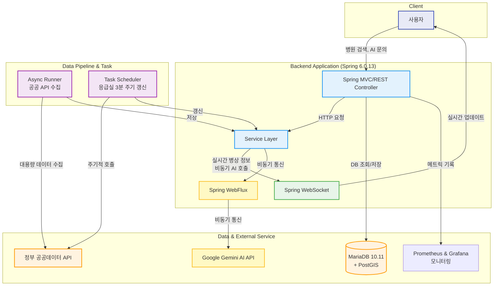
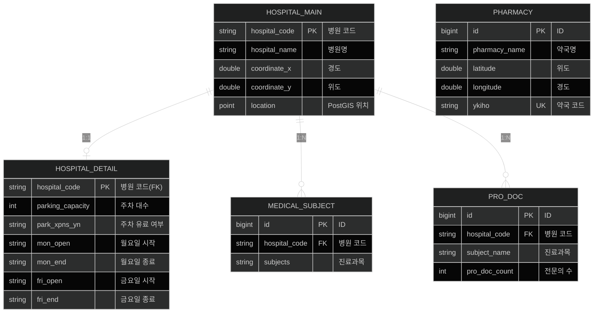

# 🏥 Hospital Information Hub - 의료 정보 통합 플랫폼

> 전국 의료기관, 약국, 응급실 정보를 실시간으로 제공하는 통합 의료 정보 시스템

[](https://openjdk.org/)
[](https://spring.io/)
[](https://mariadb.org/)
[](LICENSE)

## 📋 목차

- [프로젝트 소개](#-프로젝트-소개)
- [주요 기능](#-주요-기능)
- [기술 스택](#-기술-스택)
- [시스템 아키텍처](#-시스템-아키텍처)
- [시작하기](#-시작하기)
- [API 문서](#-api-문서)
- [데이터베이스 구조](#-데이터베이스-구조)
- [성능 최적화](#-성능-최적화)
- [배포](#-배포)
- [기여하기](#-기여하기)
- [라이센스](#-라이센스)

## 🎯 프로젝트 소개

Hospital Information Hub는 **정부 공공데이터 API**를 활용하여 전국의 의료기관, 약국, 응급실 정보를 수집하고 제공하는 통합 의료 정보 플랫폼입니다.

### 핵심 가치

- 🔍 **위치 기반 검색**: 사용자 위치 기반으로 반경 내 의료기관 검색
- ⚡ **실시간 응급실 정보**: WebSocket을 통한 3분 주기 실시간 업데이트
- 🎯 **진료과목 필터링**: 필요한 진료과만 선택하여 검색
- 📊 **질병 통계**: 국가 질병 통계 데이터 제공
- 🤖 **AI 챗봇**: Gemini AI 기반 의료 상담 챗봇

## ✨ 주요 기능

### 1. 의료기관 정보 관리
- 전국 병원 기본 정보 수집 및 관리 (79000+ 의료기관)
- 병원 상세 정보 (운영시간, 주차정보, 진료과목, 전문의 수)
- **청크 기반 멀티스레드 처리**: 100개 단위로 병원 코드 묶어 병렬 수집
- 위치 기반 검색 (PostGIS 공간 인덱스)
- 진료과목별 필터링

### 2. 약국 정보
- 전국 약국 정보 수집
- 요일별 운영시간 관리
- 위치 기반 검색

### 3. 실시간 응급실 정보
- WebSocket 기반 실시간 데이터 스트리밍
- 3분 주기 자동 갱신
- 전국 응급실 가용 병상 정보
- 변경 감지 및 효율적 브로드캐스팅

### 4. 질병 통계
- 국가 질병 통계 데이터 수집
- 기간별, 질병별 통계 조회

### 5. 추가 기능
- YouTube API 연동 의료 정보 영상
- **Gemini AI 챗봇** (WebFlux Reactive 비동기 통신)
- Prometheus + Grafana 모니터링

## 🛠 기술 스택

### Backend
```
Java 21 (Amazon Corretto)
Spring Framework 6.0.13
  ├─ Spring MVC
  ├─ Spring Data JPA
  ├─ Spring WebSocket
  └─ Spring WebFlux (Reactive - Gemini AI API)
```

### Database
```
MariaDB 10.11
  ├─ PostGIS (공간 데이터)
  └─ HikariCP (Connection Pool)
```

### Infrastructure
```
Apache Tomcat 10.1
Docker Container
Ubuntu Linux 24 (AWS EC2)
```

### External APIs
```
정부 공공데이터 포털
  ├─ 의료기관 정보
  ├─ 약국 정보
  ├─ 응급실 실시간 정보
  └─ 질병 통계

Kakao Map API
YouTube Data API v3
Google Gemini AI API
```

### Monitoring & Tools
```
Prometheus (Metrics Collection)
Grafana (Dashboard)
cAdvisor (Container Metrics)
Node Exporter (System Metrics)
Jenkins (CI/CD)
Maven 3.9 (Build Tool)
```

<details>
<summary><b>📚 Libraries & Frameworks (상세)</b></summary>

| Category | Technology | Version |
|----------|-----------|---------|
| ORM | Hibernate | 6.2.9 |
| JSON/XML | Jackson | 2.15.2 |
| WebSocket | Spring WebSocket | 6.0.13 |
| Reactive | Spring WebFlux + Reactor Netty | 6.0.13 |
| Scheduler | Quartz | 2.3.2 |
| Cache | Caffeine | 3.1.8 |
| Monitoring | Micrometer Prometheus | 1.11.4 |
| Logging | SLF4J + Logback | 2.0.13 |
| Spatial | Hibernate Spatial | 6.2.9 |

</details>

## 🏗 시스템 아키텍처

### 전체 구성도



### 데이터 흐름

#### 1. 데이터 수집 흐름
```
관리자 → API 요청 (X-API-Key) → Service → AsyncRunner (지역별 병렬)
  → Rate Limiter (5req/sec) → 정부 API → Parser → Repository → Database
```

#### 2. 데이터 조회 흐름
```
사용자 → 위치 정보 → Service → MBR 계산 → JDBC Repository
  → PostGIS 공간 검색 → 배치 로드 (N+1 방지) → DTO 변환 → JSON 응답
```

#### 3. 실시간 응급실 데이터
```
WebSocket 연결 → EmergencyLiveService → TaskScheduler (3분 주기)
  → AsyncRunner → 정부 API → 변경 감지 → Broadcast (모든 클라이언트)
```

상세한 아키텍처는 [SW_ARCHITECTURE_FLOWCHART.md](./SW_ARCHITECTURE_FLOWCHART.md)를 참고하세요.

## 🚀 시작하기

### 사전 요구사항

- Java 21 (Amazon Corretto 권장)
- Maven 3.9+
- MariaDB 10.11+
- Apache Tomcat 10.1+

### 설치

1. **저장소 클론**
```bash
git clone [https://github.com/your-username/hospitalInfoProject-backend.git](https://github.com/medical-info-hub/hospitalInfoProject-backend.git)
cd hospitalInfoProject-backend
```

2. **데이터베이스 설정**
```sql
CREATE DATABASE hospital_api_db CHARACTER SET utf8mb4 COLLATE utf8mb4_unicode_ci;
```

3. **설정 파일 구성**

`hospital_main/src/main/resources/db.properties`:
```properties
jdbc.driverClassName=org.mariadb.jdbc.Driver
jdbc.url=jdbc:mariadb://localhost:3306/hospital_api_db
jdbc.username=your_username
jdbc.password=your_password
```

`hospital_main/src/main/resources/api.properties`:
```properties
# 정부 공공데이터 API 키
hospital.main.api.key=YOUR_API_KEY
hospital.detail.api.key=YOUR_API_KEY

# YouTube API 키
youTube.api.key=YOUR_YOUTUBE_API_KEY

# Gemini AI API 키
gemini.api.key=YOUR_GEMINI_API_KEY

# 관리자 API 키
api.admin.key=YOUR_ADMIN_API_KEY
```

4. **빌드**
```bash
cd hospital_main
mvn clean package
```

5. **배포**
```bash
# WAR 파일을 Tomcat webapps 디렉토리에 복사
cp target/hospital_main-1.0-SNAPSHOT.war $TOMCAT_HOME/webapps/
```

6. **Tomcat 시작**
```bash
$TOMCAT_HOME/bin/catalina.sh run
```

### Docker로 실행 (권장)

```bash
# Docker Compose 사용
docker-compose up -d
```

## 📚 API 문서

<details>
<summary><b>🔍 API 엔드포인트 상세 보기</b></summary>

### 병원 정보 수집 API

#### 병원 기본 정보 수집
```http
POST /api/main/save
Headers:
  X-API-Key: YOUR_ADMIN_API_KEY
  Content-Type: application/json

Response:
{
  "success": true,
  "completed": 15234,
  "failed": 23
}
```

#### 수집 진행 상황 조회
```http
GET /api/main/status
Headers:
  X-API-Key: YOUR_ADMIN_API_KEY

Response:
{
  "status": "IN_PROGRESS",
  "progress": 45.5,
  "completed": 8,
  "total": 17
}
```

### 병원 검색 API

#### 위치 기반 병원 검색
```http
GET /web/hospitalsData?userLat=37.5&userLng=127.0&radius=5&limit=50

Response:
[
  {
    "hospitalCode": "JDQ4JTk1MTgxMzg=",
    "hospitalName": "서울대학교병원",
    "hospitalAddress": "서울특별시 종로구 대학로 101",
    "hospitalTel": "02-2072-2114",
    "distance": 1.23,
    "coordinateX": 127.0,
    "coordinateY": 37.5,
    "departments": ["내과", "외과", "정형외과"],
    "specialists": [
      {"subjectName": "내과", "count": 45},
      {"subjectName": "외과", "count": 32}
    ],
    "operatingHours": {
      "monday": "0900-1800",
      "tuesday": "0900-1800"
    }
  }
]
```

#### 진료과 필터링 검색
```http
GET /web/hospitalsDataFiltered?userLat=37.5&userLng=127.0&radius=5&departments=내과,외과
```

### 응급실 실시간 정보 (WebSocket)

```javascript
const ws = new WebSocket('ws://localhost:8080/emergency');

ws.onmessage = (event) => {
  const emergencyData = JSON.parse(event.data);
  console.log('응급실 데이터:', emergencyData);
};
```

### 약국 검색 API

```http
GET /web/pharmaciesData?userLat=37.5&userLng=127.0&radius=3
```

### 통합 검색 API

```http
GET /search/unifiedData?userLat=37.5&userLng=127.0&radius=5&type=all
```

</details>

## 🗄 데이터베이스 구조

### 주요 테이블 & 필드




전체 ERD는 [SW_ARCHITECTURE_FLOWCHART.md](./SW_ARCHITECTURE_FLOWCHART.md#6-데이터베이스-erd)를 참고하세요.

## ⚡ 성능 최적화

### 🗄 데이터베이스 최적화
| 항목 | 설명 |
|------|------|
| 🏎 HikariCP | Max 50 connections |
| 💾 JDBC 직접 쿼리 | JPA 오버헤드 제거 |
| 📦 배치 처리 | 100건 단위 INSERT |
| 🔗 EntityGraph | N+1 쿼리 방지 |
| 🗺 PostGIS | POINT 타입 + MBR 공간 인덱스 |

### ⚡ 비동기 처리
| 항목 | 설명 |
|------|------|
| 🧵 apiExecutor | Core 10, Max 15 threads |
| ⏱ taskScheduler | Pool 3 threads |
| 🌍 지역별 병렬 처리 | 17개 시도 동시 수집 |
| 🧩 청크 기반 처리 | 100개 단위 CompletableFuture |
| ⛔ Rate Limiting | 5-20 req/sec (Guava RateLimiter) |
| 🔄 Reactive | WebFlux + Reactor (AI API) |

### 🧰 캐싱
| 항목 | 설명 |
|------|------|
| 🧊 Caffeine Cache | 응급실 데이터 인메모리 캐싱 |
| 🏗 Hibernate 2nd Level Cache | 엔티티 캐싱 |

### 🌐 네트워크 최적화
| 항목 | 설명 |
|------|------|
| 📦 GZIP 압축 | 1KB 이상 응답 자동 압축 |
| 🔗 WebSocket | 실시간 양방향 통신 |

### 🏗 멀티스레드 처리 (HospitalDetailAsyncRunner)
| 항목 | 설명 |
|------|------|
| 🛡 Thread-safe | ConcurrentHashMap.newKeySet() 사용 |
| 📦 배치 INSERT/UPDATE | 100건 단위 JDBC 배치 처리 |
| ⛔ Rate Limiting | 청크 내부 20 req/sec 제한 |

### 🔮 WebFlux Reactive (AIApiCaller)
| 항목 | 설명 |
|------|------|
| 💾 Connection Pool | Reactor Netty (Max 50 connections) |
| ⏳ Timeout | Connect 5s, Read/Write 60s |
| 🧠 Memory Buffer | 10MB (대용량 AI 응답 처리) |

### 📊 성능 지표
- 🚀 병원 검색 응답 시간: < 200ms (반경 5km, 4000개 결과)  
- 🏃 데이터 수집 처리량: ~1,000 병원/분 → ~5,000 병원/분 (청크 멀티스레드)  
- ⏱ 응급실 실시간 업데이트: 3분 주기, < 1초 지연  
- 🤖 AI 챗봇 응답 시간: 평균 2-5초 (Reactive 비동기)
  
## 🔒 보안
| 항목 | 설명 |
|------|------|
| 🔑 API 키 인증 | X-API-Key 헤더 기반 관리자 인증 |
| 🛡 HTTPS/TLS | 모든 외부 API 통신 암호화 |
| 🛡 SQL Injection 방지 | PreparedStatement 사용 |
| 📝 입력 검증 | Validator를 통한 데이터 검증 |
| 🌐 CORS 정책 | 허용된 출처만 접근 가능 |

## 📊 모니터링

### Prometheus Metrics
```http
GET /metrics

# HELP http_requests_total Total HTTP requests
# TYPE http_requests_total counter
http_requests_total{method="GET",endpoint="/web/hospitalsData"} 12543

# HELP jvm_memory_used_bytes Used JVM memory
# TYPE jvm_memory_used_bytes gauge
jvm_memory_used_bytes{area="heap"} 536870912
```

### Grafana Dashboard
- HTTP 요청 통계
- 데이터베이스 커넥션 풀 상태
- JVM 메모리 사용량
- API 호출 성공/실패율
- 응답 시간 분포

## 🐳 배포

<details>
<summary><b>🐋 Docker Compose 설정 보기</b></summary>

```yaml
version: '3.8'

services:
  mariadb:
    image: mariadb:10.11
    environment:
      MYSQL_DATABASE: hospital_api_db
      MYSQL_ROOT_PASSWORD: your_password
    volumes:
      - mariadb_data:/var/lib/mysql

  app:
    build: .
    ports:
      - "8080:8080"
    depends_on:
      - mariadb
    environment:
      JDBC_URL: jdbc:mariadb://mariadb:3306/hospital_api_db

  prometheus:
    image: prom/prometheus
    ports:
      - "9090:9090"
    volumes:
      - ./prometheus.yml:/etc/prometheus/prometheus.yml

  grafana:
    image: grafana/grafana
    ports:
      - "3000:3000"
    depends_on:
      - prometheus

volumes:
  mariadb_data:
```

</details>

### Jenkins CI/CD

1. GitHub 코드 푸시
2. Jenkins 자동 빌드 트리거
3. Maven 빌드 (`mvn clean package`)
4. Docker 이미지 생성
5. Docker Container 배포
6. Health Check

## 🧪 테스트

```bash
# 단위 테스트
mvn test

# 통합 테스트
mvn verify

# 커버리지 리포트
mvn jacoco:report
```

## 📈 로드맵

- [ ] **v2.0**: Spring Boot 전환
- [ ] **v2.1**: Redis 캐시 도입
- [ ] **v2.2**: Elasticsearch 검색 엔진
- [ ] **v2.3**: Kubernetes 배포
- [ ] **v2.4**: GraphQL API 지원
- [ ] **v2.5**: 개인화 추천 시스템

## 🤝 기여하기

기여는 언제나 환영합니다!

1. Fork the Project
2. Create your Feature Branch (`git checkout -b feature/AmazingFeature`)
3. Commit your Changes (`git commit -m 'Add some AmazingFeature'`)
4. Push to the Branch (`git push origin feature/AmazingFeature`)
5. Open a Pull Request

## 📝 라이센스

이 프로젝트는 MIT 라이센스 하에 배포됩니다. 자세한 내용은 [LICENSE](LICENSE) 파일을 참고하세요.

## 👥 팀

- **Backend Developer**: [YOUHEETAE](https://github.com/YOUHEETAE)  
  - Spring MVC, REST API, DB 설계, 데이터 파이프라인

- **Frontend Developer**: [BAEBAE](https://github.com/BAE999)  
  - Flutter, UI/UX, API 연동
    
- **Documentation & QA**: [이희재](https://github.com/0dlgmlwo0)
  - 팀장, 문서 작성, 코드 리뷰,  DB 설계
    
- **Deployment & DevOps**: [Park-M-S](https://github.com/Park-M-S)
  - AWS / Docker, CI/CD, 배포 자동화  


## 📞 연락처

프로젝트 관련 문의: dbgmlxo01@g.shingu.ac.kr

프로젝트 링크: [https://github.com/medical-info-hub/hospitalInfoProject-backend.git](https://github.com/medical-info-hub/hospitalInfoProject-backend.git)

## 🙏 감사의 말

- [공공데이터포털](https://www.data.go.kr/) - 의료 데이터 제공
- [Spring Framework](https://spring.io/) - 강력한 백엔드 프레임워크
- [MariaDB Foundation](https://mariadb.org/) - 안정적인 데이터베이스
- [PostGIS](https://postgis.net/) - 공간 데이터 처리

---