# 병원 정보 프로젝트 - SW 구성도 및 흐름도

## 1. 전체 시스템 아키텍처 (SW 구성도)

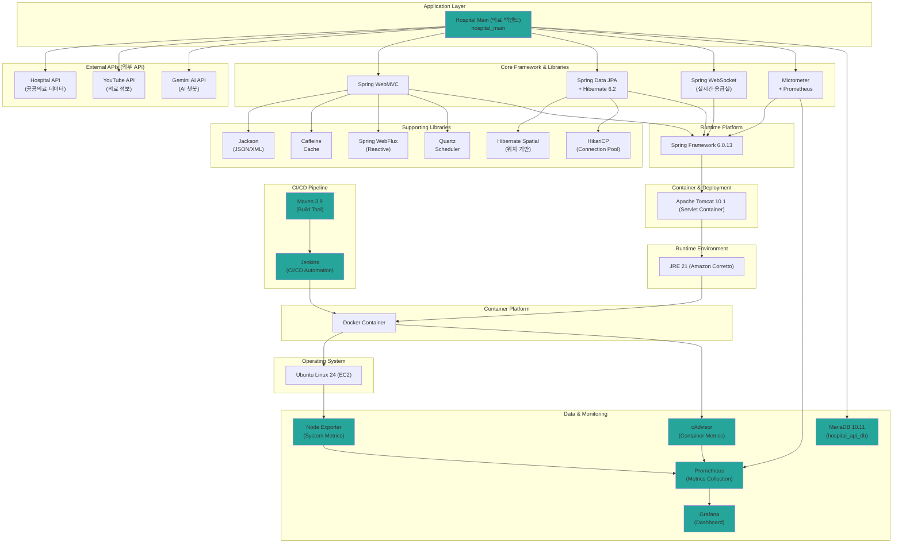

## 2. 레이어별 상세 구성도

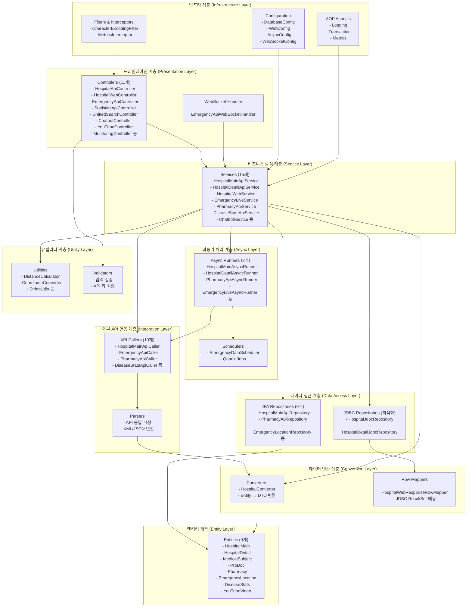

## 3. 데이터 흐름도 (Data Flow Diagram)

### 3.1 병원 데이터 수집 흐름

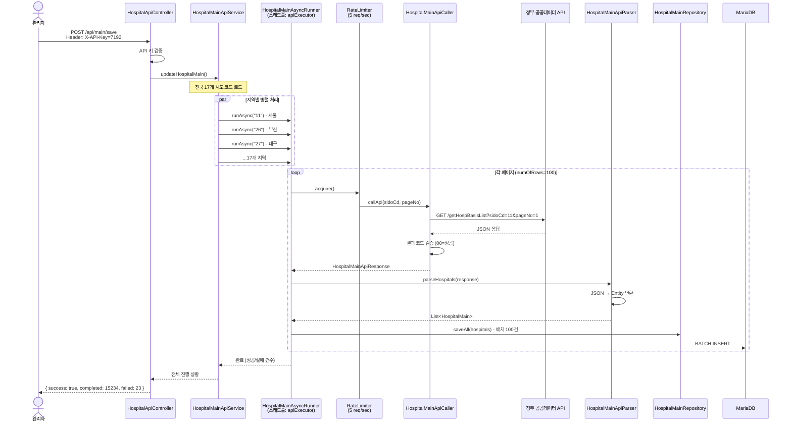

### 3.2 병원 검색 흐름 (위치 기반)

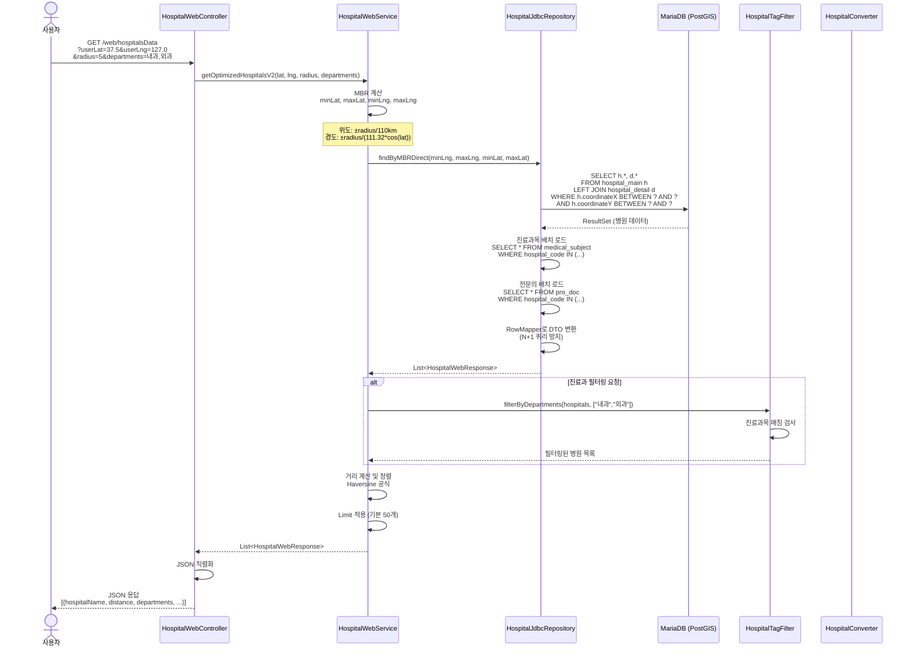

### 3.3 응급실 실시간 데이터 흐름

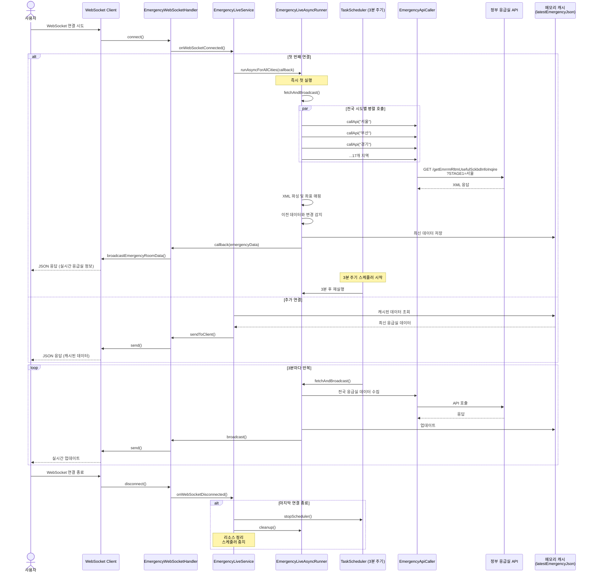

## 4. 컴포넌트 다이어그램

```mermaid
graph TB
    subgraph "Hospital Main Application"
        subgraph "API Controllers"
            C1[HospitalApiController<br/>/api/main, /api/details]
            C2[EmergencyApiController<br/>/api/emergency]
            C3[StatisticsApiController<br/>/api/stats]
            C4[HospitalWebController<br/>/web]
            C5[UnifiedSearchController<br/>/search]
        end

        subgraph "Services"
            S1[HospitalMainApiService]
            S2[HospitalWebService]
            S3[EmergencyLiveService]
            S4[DiseaseStatsApiService]
            S5[UnifiedSearchService]
        end

        subgraph "Async Processing"
            A1[HospitalMainAsyncRunner]
            A2[EmergencyLiveAsyncRunner]
            A3[ThreadPoolTaskExecutor<br/>apiExecutor: 10-15]
            A4[TaskScheduler<br/>Pool: 3]
        end

        subgraph "External Integration"
            I1[HospitalMainApiCaller]
            I2[EmergencyApiCaller]
            I3[PharmacyApiCaller]
            I4[DiseaseStatsApiCaller]
            I5[RateLimiter<br/>5 req/sec]
        end

        subgraph "Data Access"
            D1[HospitalMainRepository<br/>JPA]
            D2[HospitalJdbcRepository<br/>JDBC]
            D3[PharmacyRepository]
            D4[EmergencyLocationRepository]
            D5[HikariCP<br/>Max: 50 connections]
        end

        subgraph "Caching & Optimization"
            O1[Caffeine Cache]
            O2[Hibernate Second Level Cache]
            O3[EntityGraph<br/>N+1 쿼리 방지]
        end
    end

    subgraph "External Systems"
        E1[정부 공공데이터 API<br/>의료기관/응급실/통계]
        E2[Google Gemini AI<br/>챗봇]
        E3[YouTube API<br/>의료 영상]
    end

    subgraph "Database"
        DB1[(MariaDB 10.11<br/>hospital_api_db)]
        DB2[PostGIS Extension<br/>공간 데이터 처리]
    end

    subgraph "Monitoring Stack"
        M1[Micrometer]
        M2[Prometheus]
        M3[Grafana]
        M4[cAdvisor]
        M5[Node Exporter]
    end

    C1 --> S1
    C2 --> S3
    C3 --> S4
    C4 --> S2
    C5 --> S5

    S1 --> A1
    S3 --> A2
    A1 --> A3
    A2 --> A4

    A1 --> I1
    A2 --> I2
    I1 --> I5
    I2 --> I5
    I3 --> I5
    I4 --> I5

    I1 --> E1
    I2 --> E1
    I3 --> E1
    I4 --> E1

    S2 --> D2
    S1 --> D1
    S3 --> D4
    S5 --> D3

    D1 --> O3
    D2 --> D5
    S3 --> O1

    D1 --> DB1
    D2 --> DB1
    D3 --> DB1
    D4 --> DB1

    DB1 --> DB2

    S1 --> M1
    S2 --> M1
    S3 --> M1
    M1 --> M2
    M2 --> M3
    M4 --> M2
    M5 --> M2
```

## 5. 배포 아키텍처 다이어그램

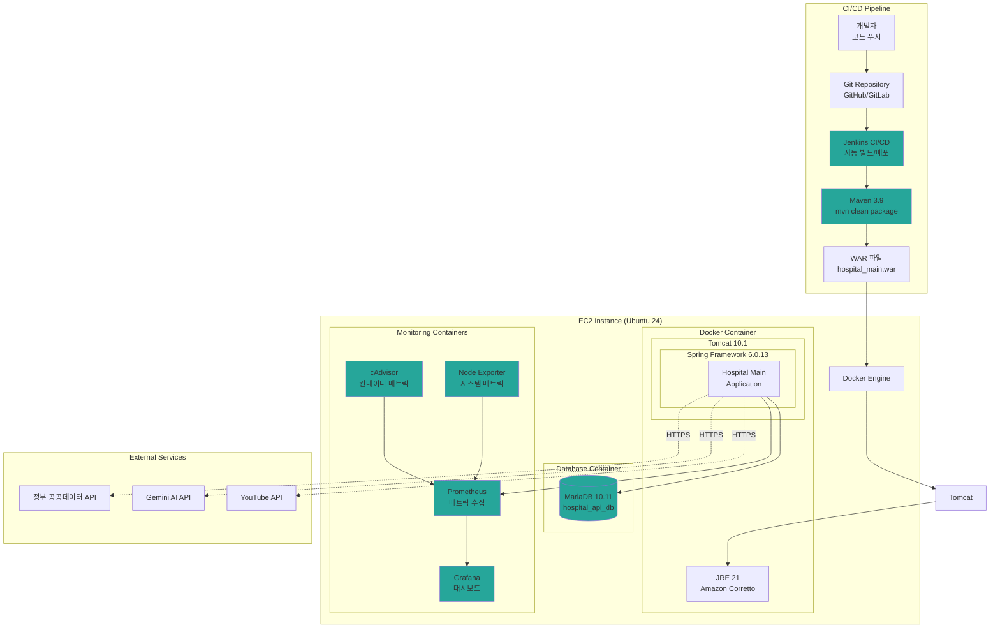

## 7. 성능 최적화 전략

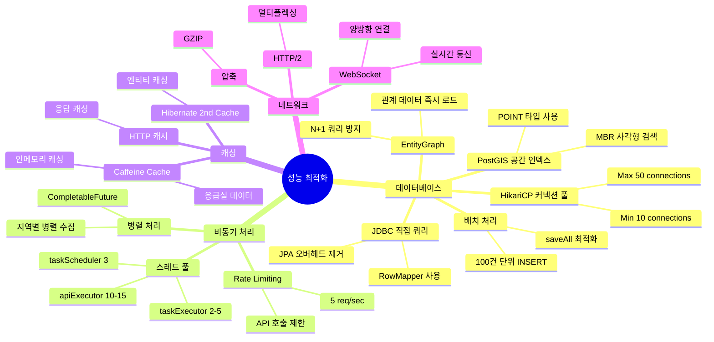

## 8. 보안 아키텍처

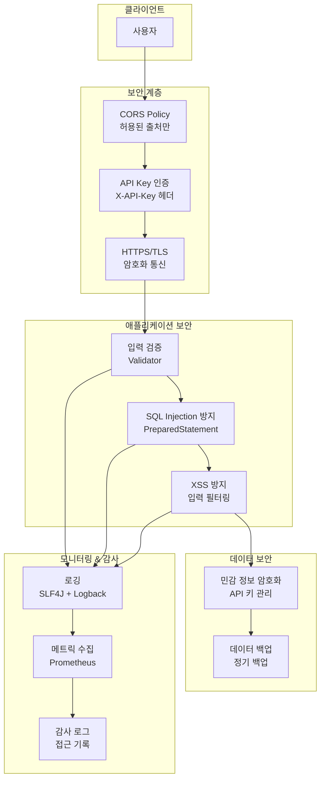

## 9. 에러 처리 흐름

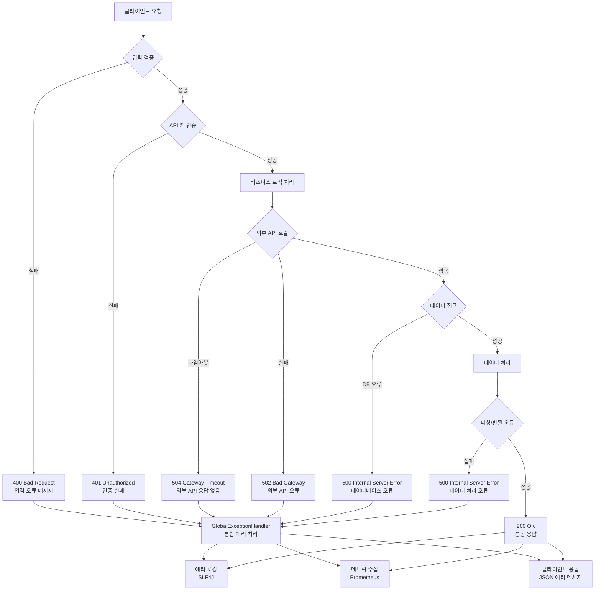

## 10. 주요 API 엔드포인트 맵

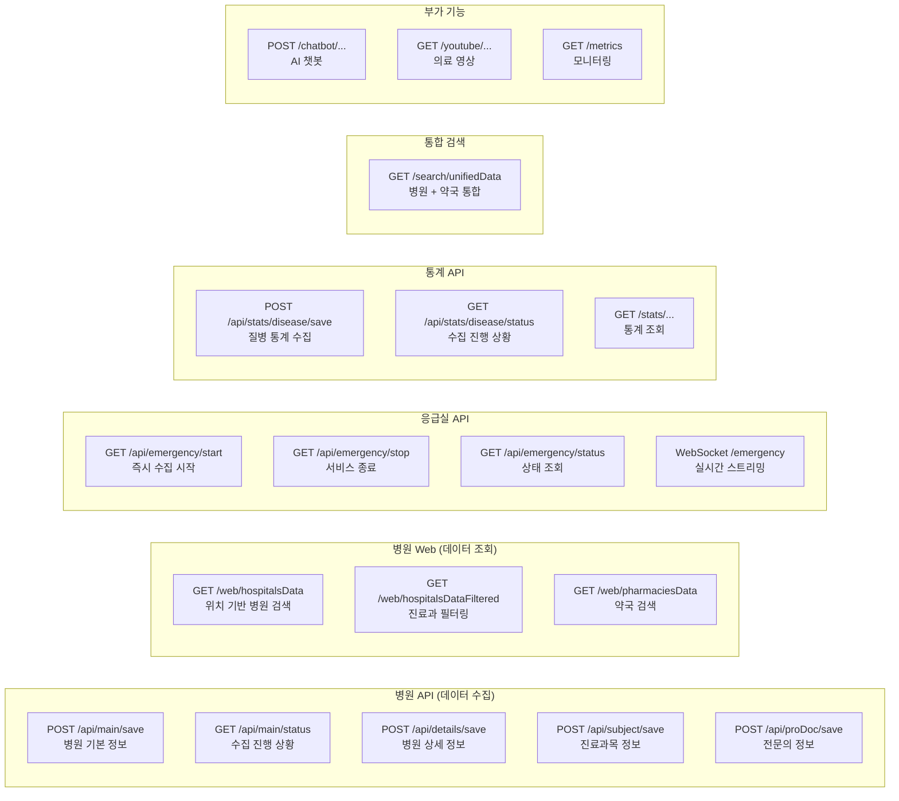

## 요약

### 핵심 기술 스택
- **Runtime**: JRE 21 (Amazon Corretto) → Docker Container → Ubuntu Linux 24 (EC2)
- **Framework**: Spring Framework 6.0.13 + Spring MVC + Spring Data JPA
- **Database**: MariaDB 10.11 (PostGIS 공간 데이터)
- **Container**: Apache Tomcat 10.1
- **Monitoring**: Prometheus + Grafana + cAdvisor + Node Exporter
- **CI/CD**: Jenkins + Maven 3.9

### 주요 아키텍처 패턴
1. **비동기 병렬 처리**: 지역별 데이터 수집을 스레드 풀로 병렬화
2. **Rate Limiting**: API 호출 제한 (5 req/sec)
3. **JDBC 최적화**: N+1 쿼리 방지 및 성능 최적화
4. **WebSocket 실시간 통신**: 응급실 데이터 3분 주기 업데이트
5. **캐싱 전략**: Caffeine + Hibernate 2차 캐시
6. **공간 데이터 처리**: PostGIS + MBR 검색

### 데이터 흐름
1. **수집**: 정부 API → Parser → Entity → Database
2. **조회**: Database → JDBC Query → RowMapper → DTO → JSON
3. **실시간**: WebSocket → Scheduler → API → Broadcast → Client
