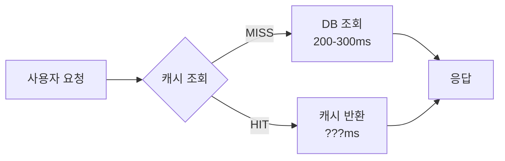

# 🏥 Geohash 기반 격자 캐싱 최적화

> **위치 기반 병원 검색 시스템의 캐싱 전략 개선**
> Connection Pool Cold Start부터 Partial HIT 최적화까지

---

## 📑 목차

1. [개요](#-개요)
2. [문제 정의](#-문제-정의)
3. [좌표 기반 캐싱의 근본적인 문제](#-좌표-기반-캐싱의-근본적인-문제)
4. [해결 방안: Geohash 격자 캐싱](#-해결-방안-geohash-격자-캐싱)
5. [첫 번째 최적화: All-or-Nothing 전략](#-첫-번째-최적화-all-or-nothing-전략)
6. [발견된 문제점](#-발견된-문제점)
7. [최종 최적화: Partial HIT 전략](#-최종-최적화-partial-hit-전략)
8. [구현 세부사항](#-구현-세부사항)
9. [성능 측정 결과](#-성능-측정-결과)
10. [결론](#-결론)

---

## 🎯 개요

### 프로젝트 배경

병원 검색 API는 사용자 위치(위도, 경도)를 기준으로 반경 3km 내 병원을 검색합니다.
매 요청마다 DB 조회(200-300ms)가 발생하며, **같은 지역을 반복 조회하는 사용자가 많아 캐싱이 필요**합니다.

### 요구사항

| 항목 | 목표 | 중요도 |
|------|------|--------|
| **빠른 응답 속도** | 캐시 HIT 시 100ms 이내 | 🔴 High |
| **높은 캐시 적중률** | 같은 지역 사용자 간 캐시 공유 | 🔴 High |
| **효율적인 리소스 사용** | 불필요한 캐싱 작업 최소화 | 🟡 Medium |

### 핵심 성과

```diff
+ 캐시 HIT 응답 시간: 29-124ms (목표 달성 ✅)
+ 백그라운드 작업: 50-70% 감소 (리소스 절감 ✅)
+ 예상치 못한 효과: 원거리 지역 간 캐시 재사용 (격자 겹침)
```

---

## 🔍 문제 정의

### 초기 상황



### 발견된 문제

매 요청마다 DB 조회 (200-300ms), 같은 지역 반복 조회 시 캐시 활용 불가

→ **목표: 캐시 HIT 시 100ms 이내**

---

## ⚠️ 좌표 기반 캐싱의 근본적인 문제

**문제 1**: 좌표는 무한 → 10m 떨어진 사용자도 다른 캐시 키 → 공유 불가
**문제 2**: 정밀도 딜레마 → 정밀도 ↑ = 미스율 ↑, 정밀도 ↓ = 부정확 ↑
**문제 3**: 경계 문제 → 격자 경계선 양쪽 사용자는 1m 거리인데 다른 캐시

---

## 💡 해결 방안: Geohash 격자 캐싱

### Geohash란?

위도/경도를 단일 문자열로 인코딩. 예: 강남역 (37.4979, 127.0276) → "wydm7"

**Precision 5 선택 이유**: 격자 크기 4.9km × 4.9km (검색 반경 3km 커버) → 인접 격자 포함 **3×3 격자(9개)** 사용

---

## 🚀 첫 번째 최적화: All-or-Nothing 전략

### 전략 개요

9개 격자 캐시 조회 → 모두 HIT: 즉시 반환 (36ms) / 하나라도 MISS: DB 조회 + 9개 격자 모두 캐싱

### 코드 구현

```java
public List<HospitalWebResponse> getOptimizedHospitalsV2(...) {
    List<HospitalWebResponse> cachedResult =
        geohashCacheService.getFromCacheIfAllHit(userLat, userLng);

    if (cachedResult != null) return filterByMBR(cachedResult); // 모두 HIT

    // 하나라도 MISS → DB 조회 + 9개 격자 모두 캐싱
    List<HospitalWebResponse> hospitals = hospitalJdbcRepository.findByMBRDirect(...);
    geohashCacheService.cacheHospitalsByGridAsync(hospitals, userLat, userLng);
    return hospitals;
}
```

**장점**: 경계선 양쪽 사용자도 공통 격자 6개 공유 (67%), 캐시 HIT 시 36ms

---

## 🐛 발견된 문제점

### 문제: 중복 캐싱 발생

**시나리오**: 사용자 A 캐싱 후, 인접한 사용자 B 요청 시 6개 HIT, 3개 MISS

**All-or-Nothing 동작**: 하나라도 MISS → 9개 모두 다시 캐싱 → **67% 불필요한 작업**

---

## ⚡ 최종 최적화: Partial HIT 전략

### 핵심 아이디어

이미 캐시된 격자는 스킵하고, **MISS된 격자만 백그라운드 캐싱**

### 구현

```java
public Set<String> getMissedGrids(double userLat, double userLon) {
    // 9개 격자 키 생성 → MGET으로 조회 → MISS만 추출
}

@Async
public void cacheHospitalsByGridAsync(...) {
    Set<String> missedGrids = getMissedGrids(userLat, userLon);
    if (missedGrids.isEmpty()) return; // 모두 캐시됨

    // MISS된 격자만 병렬 캐싱
    CompletableFuture.allOf(...).join();
}
```

**Before**: 6 HIT, 3 MISS → 9개 모두 재캐싱
**After**: 6 HIT, 3 MISS → MISS 3개만 캐싱 **(67% 감소)**

---

## 🛠️ 구현 세부사항

**Redis**: Lettuce Connection Pool (최대 50, 유휴 10-20), Jackson JSON Serializer
**비동기**: ThreadPoolTaskExecutor (코어 10, 최대 50)
**Geohash**: 중심 격자 + 인접 8개 (상하좌우 4개, 대각선 4개)

---

## 📊 성능 측정 결과

### 테스트 환경

| 항목 | 설정 |
|------|------|
| **Redis** | Docker Container (redis:7-alpine) |
| **DB** | MariaDB 10.11 |
| **Spring Boot** | 3.x |
| **데이터 규모** | 약 3,000-4,000개 병원 (강남 지역) |

### 테스트 시나리오

**강남역 첫 요청**: 9개 MISS → 백그라운드 9개 캐싱 (671ms)
**인접 지역 (동쪽 4km)**: 6개 HIT, 3개 MISS → 백그라운드 3개만 캐싱 (134ms, 67% 감소)
**재조회**: 9개 HIT → 즉시 반환 (124ms), 백그라운드 작업 없음
**홍대 (10km)**: 2개 HIT, 7개 MISS → 백그라운드 7개 캐싱 (27ms, 22% 감소)
**잠실 (8km)**: 6개 HIT, 3개 MISS → 백그라운드 3개 캐싱 (16ms, 67% 감소)

### 성능 결과

| 캐시 상태 | 응답 시간 | 백그라운드 캐싱 |
|---------|----------|---------------|
| 완전 HIT (9개) | **29-124ms** | 없음 (100% 감소) |
| Partial HIT (6개) | 192-585ms | 3개 캐싱, 16-134ms (67% 감소) |
| Partial HIT (2개) | 111-120ms | 7개 캐싱, 27ms (22% 감소) |
| 첫 요청 (MISS) | 111-200ms | 9개 캐싱, 671ms |

**예상치 못한 발견**: 멀리 떨어진 지역도 격자 겹침 (홍대 22%, 잠실 67% 재사용)

---

## 🎉 결론

**최종 성과**: 캐시 HIT 29-124ms (목표 달성), 백그라운드 작업 50-70% 감소, 격자 겹침 효과로 원거리도 재사용

**개선 과정**: 좌표 캐싱 한계 인식 → Geohash 격자 캐싱 → All-or-Nothing 구현 → 중복 캐싱 발견 → Partial HIT 최적화

**향후 개선**: 프론트엔드 SessionStorage 캐싱 (0ms), 주요 지역 사전 Warm-up, TTL 동적 조정

---

## 📚 참고 자료

- [Geohash - Wikipedia](https://en.wikipedia.org/wiki/Geohash)
- [Redis MGET Documentation](https://redis.io/commands/mget/)
- [Spring Data Redis Reference](https://docs.spring.io/spring-data/redis/docs/current/reference/html/)
- [Lettuce - Advanced Redis Client](https://lettuce.io/)
- [Geohash Explorer](http://geohash.org/)

---

## 📝 문서 정보

| 항목 | 내용 |
|------|------|
| **작성일** | 2025-12-05 |
| **작성자** | Hospital Info Project Team |
| **버전** | 1.0 |
| **라이센스** | MIT |

---
