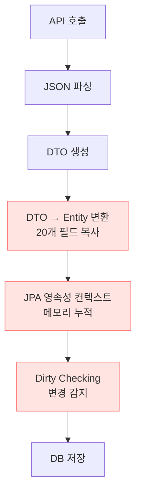
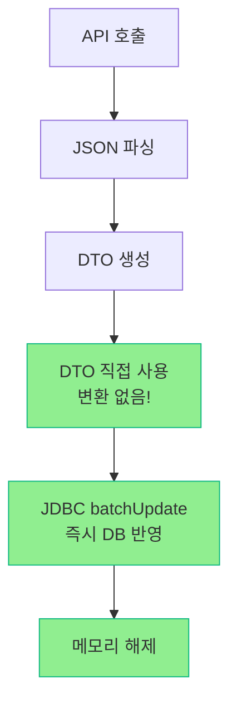
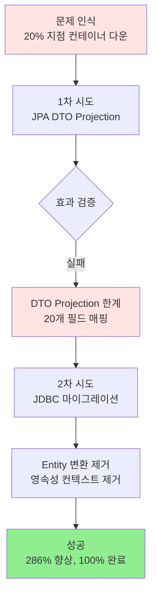

# 🔄 JPA에서 JDBC로: 엔티티 변환 오버헤드 극복기

> **DTO Projection의 한계를 넘어 JDBC 직접 제어로 286% 성능 향상**
> 20개 필드 매핑의 함정부터 컨테이너 다운 극복까지

---

## 📑 목차

1. [개요](#-개요)
2. [문제 정의: 20% 지점에서 컨테이너 다운](#-문제-정의-20-지점에서-컨테이너-다운)
3. [1차 시도: JPA DTO Projection](#-1차-시도-jpa-dto-projection)
4. [DTO Projection이 실패한 이유](#-dto-projection이-실패한-이유)
5. [2차 해결: JDBC Template 마이그레이션](#-2차-해결-jdbc-template-마이그레이션)
6. [성능 측정 결과](#-성능-측정-결과)
7. [결론](#-결론)

---

## 🎯 개요

### 프로젝트 배경

병원 상세정보 수집 시스템에서 **79,081개 병원 데이터**를 외부 API로부터 수집하고 DB에 저장하는 배치 작업을 진행했습니다.
공공데이터포털 API에서 주차 정보, 진료 시간 등 **20개 필드**를 수집하여 저장해야 했습니다.

### 왜 최적화가 필요했는가?

단순히 "느린 것"이 아니라, **작업 자체가 완료되지 않는 치명적 문제**였습니다.

```
초기 처리 상황:
┌─────────────────────────────────────┐
│ 목표: 79,081개 병원 데이터 수집     │
│ 현실: 20% 지점(약 16,000개)에서     │
│       컨테이너 셧다운 🔥            │
│                                     │
│ 원인: JPA 엔티티 변환 오버헤드      │
│       영속성 컨텍스트 메모리 누적   │
└─────────────────────────────────────┘
```

**핵심 문제**:
- 전체 데이터의 **약 20% 처리 시점에서 컨테이너가 다운**
- 메모리/CPU 부하로 인한 시스템 다운
- 예상 소요 시간: 2시간 45분 → 실제: **완료 불가능**

**최적화 목표**:
- 79,081개 전체 데이터 **안정적으로 완료**
- 컨테이너 안정성 확보
- 처리 속도 향상

### 기술 스택

| 항목 | 기술 |
|------|------|
| **Backend** | Java 21, Spring 6.0.13 |
| **ORM** | JPA 3.0.11 → Spring JDBC |
| **DB** | MariaDB 10.11 |
| **Connection Pool** | HikariCP |
| **동시성 제어** | Google Guava RateLimiter |

### 핵심 성과

```diff
+ 처리 완료율: 20% → 100% (완료 가능 ✅)
+ 처리 속도: 7건/초 → 20건/초 (286% 향상 ✅)
+ 소요 시간: 불가능 → 1시간 6분 ✅
+ 메모리 사용: OOM 발생 → 안정화 ✅
```

---

## ⚠️ 문제 정의: 20% 지점에서 컨테이너 다운

### 초기 구현

```java
@Service
public class HospitalDetailService {

    private final HospitalDetailRepository repository;  // JPA Repository
    private final HospitalDetailApiCaller apiCaller;
    private final HospitalDetailApiParser parser;

    public void collectHospitalDetails(List<String> hospitalCodes) {
        for (String hospitalCode : hospitalCodes) {
            // 1. API 호출
            HospitalDetailApiResponse response = apiCaller.callApi(hospitalCode);

            // 2. JSON 파싱 → DTO 생성
            List<HospitalDetailApiItem> items = parser.parse(response);

            // 3. DTO → Entity 변환 (문제 발생!)
            List<HospitalDetail> entities = items.stream()
                .map(this::convertDtoToEntity)
                .collect(Collectors.toList());

            // 4. JPA 저장
            repository.saveAll(entities);
        }
    }

    // 매 API 호출마다 실행되는 변환 로직
    private HospitalDetail convertDtoToEntity(HospitalDetailApiItem item) {
        HospitalDetail entity = new HospitalDetail();
        entity.setHospitalCode(item.getHospitalCode());
        entity.setParkingCapacity(item.getParkQty());
        // ...총 20개 필드 수동 매핑!
        return entity;
    }
}
```

### 처리 흐름

```
┌──────────────────────────────────────────────────────────┐
│  API 호출 (79,081번)                                      │
│      ↓                                                    │
│  JSON 파싱 → DTO 생성                                     │
│      ↓                                                    │
│  DTO → Entity 변환 (20개 필드 × 79,081번)  ← 병목!       │
│      ↓                                                    │
│  JPA 영속성 컨텍스트 (메모리 누적)        ← 병목!       │
│      ↓                                                    │
│  DB 저장                                                  │
└──────────────────────────────────────────────────────────┘
```

### 발견된 문제점

#### 1. JPA Entity 변환 오버헤드

```java
// 79,081번 반복되는 작업:
HospitalDetail entity = new HospitalDetail();  // 객체 생성
entity.setHospitalCode(...);                   // 필드 1
entity.setParkingCapacity(...);                // 필드 2
// ... 20개 필드 일일이 복사
```

**문제**:
- 매 API 호출마다 새로운 Entity 객체 생성
- 20개 필드를 일일이 복사
- 79,081번 반복 시 **누적 오버헤드 발생**

#### 2. JPA 영속성 컨텍스트 메모리 누적

```
시간이 지날수록:
┌─────────────────────────────────────┐
│ JPA 1차 캐시                        │
│ ┌─────────────────────────────────┐ │
│ │ Entity 1                        │ │
│ │ Entity 2                        │ │
│ │ Entity 3                        │ │
│ │ ...                             │ │
│ │ Entity 16,000 ← 메모리 과부하!   │ │
│ └─────────────────────────────────┘ │
│                                     │
│ + Dirty Checking                    │
│ + 변경 감지 오버헤드                │
│ = 컨테이너 다운! 🔥                 │
└─────────────────────────────────────┘
```

#### 3. 처리 속도 측정 결과

```
초기 처리:     약 7건/초 (RateLimiter 8 설정에 못 미침)
         ↓
시간 경과:     오버헤드 누적으로 점점 느려짐
         ↓
20% 지점:      Out of Memory / CPU 과부하
         ↓
컨테이너 셧다운 🔥
```

### 핵심 원인

> **"API 호출 속도가 아닌, JPA 엔티티 변환 및 영속성 컨텍스트 관리가 병목"**

---

## 🔧 1차 시도: JPA DTO Projection

### 전략: Entity 거치지 않고 DTO로 직접 조회

> **"Entity 변환이 문제라면, DTO Projection으로 직접 조회하면 되지 않을까?"**

JPA의 DTO Projection 기능을 사용하면 Entity를 거치지 않고 DTO로 바로 매핑할 수 있습니다.

### 구현 시도

#### 1. Projection 인터페이스 정의

```java
public interface HospitalDetailProjection {
    String getHospitalCode();
    Integer getParkQty();
    //...20개 Getter 메서드
}
```

#### 2. Repository에 Projection 쿼리 추가

```java
public interface HospitalDetailRepository extends JpaRepository<HospitalDetail, String> {

    // DTO Projection 사용
    List<HospitalDetailProjection> findByHospitalCodeIn(List<String> hospitalCodes);
}
```

#### 3. Service에서 사용

```java
public void loadExistingDetails(List<String> hospitalCodes) {
    // Entity가 아닌 Projection으로 조회
    List<HospitalDetailProjection> projections =
        repository.findByHospitalCodeIn(hospitalCodes);

    // Projection → ApiItem 변환
    Map<String, HospitalDetailApiItem> existingMap = projections.stream()
        .collect(Collectors.toMap(
            HospitalDetailProjection::getHospitalCode,
            this::convertProjectionToApiItem
        ));
}

private HospitalDetailApiItem convertProjectionToApiItem(HospitalDetailProjection proj) {
    HospitalDetailApiItem item = new HospitalDetailApiItem();
    item.setHospitalCode(proj.getHospitalCode());
    item.setParkQty(proj.getParkQty() != null ? proj.getParkQty().toString() : null);
    item.setParkXpnsYn(proj.getParkXpnsYn());
    // ... 20개 필드 매핑
    return item;
}
```

### 기대 효과

```diff
기존 (Entity):
  DB → Entity 객체 생성 → 20개 필드 매핑 → 영속성 컨텍스트 관리

DTO Projection 기대:
  DB → DTO 직접 매핑 (Entity 생략) → 오버헤드 감소?
```

---

## ❌ DTO Projection이 실패한 이유

### 실제 결과: 효과 미미

```
처리 속도: 7건/초 → 7.5건/초 (약간 향상)
메모리: 여전히 누적 발생
결과: 20% 지점에서 여전히 컨테이너 다운 ❌
```

### 원인 분석

#### 1. 매핑 필드가 너무 많음 (20개)

```java
// Projection도 결국 20개 필드를 매핑해야 함
interface HospitalDetailProjection {
    String getHospitalCode();    // 1
    Integer getParkQty();         // 2
    String getParkXpnsYn();       // 3
    // ... 17개 더
}

// 그리고 다시 ApiItem으로 변환
HospitalDetailApiItem item = new HospitalDetailApiItem();
item.setHospitalCode(proj.getHospitalCode());  // 복사 1
item.setParkQty(proj.getParkQty()...);         // 복사 2
// ... 18개 더 복사
```

**문제**:
- Projection → ApiItem 변환 과정에서 **또 다시 20개 필드 복사**
- Entity 변환과 본질적으로 다를 바 없음

#### 2. JPA는 여전히 내부적으로 Entity를 거침

```
실제 JPA 동작:
┌────────────────────────────────────────┐
│  1. DB 조회                            │
│  2. ResultSet → Entity 임시 생성       │  ← Entity 생략 안 됨!
│  3. Entity → Projection 변환           │
│  4. 영속성 컨텍스트 일부 관리          │  ← 오버헤드 여전히 존재
└────────────────────────────────────────┘
```

**JPA Projection의 내부 동작**:
- Projection이라고 해도 JPA는 **내부적으로 Entity를 거침**
- Hibernate가 ResultSet → Entity → Projection 변환
- 영속성 컨텍스트 관리 오버헤드 **여전히 존재**

#### 3. 영속성 컨텍스트 메모리 누적 여전

```java
@Transactional  // 트랜잭션 범위 내에서
public void processChunk(List<String> chunk) {
    // Projection 조회해도
    List<HospitalDetailProjection> projections =
        repository.findByHospitalCodeIn(chunk);

    // JPA는 여전히 1차 캐시에 보관
    // 메모리 누적 발생 ❌
}
```

### DTO Projection의 한계

```diff
- 20개 필드 매핑 비용: Entity와 동일
- JPA 내부 동작: Entity 거침
- 영속성 컨텍스트: 여전히 메모리 누적
- 대량 데이터 처리: 부적합

→ DTO Projection은 "조회" 최적화일 뿐,
  "대량 배치 처리"에는 한계가 있음
```

### 교훈

> **"필드가 20개나 되는 복잡한 매핑에서는 DTO Projection도 근본적인 해결책이 아니다"**

JPA의 어떤 기능을 써도:
1. 영속성 컨텍스트 오버헤드
2. 20개 필드 매핑 비용
3. 메모리 누적 문제

이 세 가지는 피할 수 없었습니다.

---

## 🚀 2차 해결: JDBC Template 마이그레이션

### 핵심 아이디어

> **"JPA를 완전히 버리고 JDBC로 직접 제어하자"**

JPA의 편리함을 포기하더라도, **대량 배치 처리**에서는 JDBC 직접 제어가 훨씬 효율적입니다.

### 구현 단계

#### 1. RowMapper로 직접 매핑

```java
@Repository
public class HospitalDetailJdbcRepository {

    @Autowired
    private JdbcTemplate jdbcTemplate;

    private static final RowMapper<HospitalDetailApiItem> ROW_MAPPER = (rs, rowNum) -> {
        HospitalDetailApiItem item = new HospitalDetailApiItem();
        item.setHospitalCode(rs.getString("hospital_code"));
        item.setParkQty(rs.getString("parking_capacity"));
        // ... 20개 필드 직접 매핑
        return item;
    };
}
```

**장점**:
- ✅ Entity 변환 단계 **완전 제거**
- ✅ ResultSet → ApiItem **직접 매핑**
- ✅ 영속성 컨텍스트 **완전 제거**

#### 2. Batch Insert/Update 구현

```java
@Transactional
public void batchInsert(List<HospitalDetailApiItem> items) {
    String sql = "INSERT INTO hospital_detail " +
            "(hospital_code, parking_capacity, ...) " +  // 20개 필드
            "VALUES (?, ?, ...)";

    List<Object[]> batchArgs = items.stream()
            .map(item -> new Object[]{
                item.getHospitalCode(),
                parseInteger(item.getParkQty()),
                // ... 18개 필드 더
            })
            .collect(Collectors.toList());

    int[] results = jdbcTemplate.batchUpdate(sql, batchArgs);
    log.info("병원 상세정보 INSERT 완료: {}건", results.length);
}

@Transactional
public void batchUpdate(List<HospitalDetailApiItem> items) {
    String sql = "UPDATE hospital_detail SET " +
            "parking_capacity = ?, park_xpns_yn = ?, ... " +  // 19개 필드
            "WHERE hospital_code = ?";

    List<Object[]> batchArgs = items.stream()
            .map(item -> new Object[]{
                parseInteger(item.getParkQty()),
                // ... 18개 필드 더
                item.getHospitalCode()  // WHERE 조건
            })
            .collect(Collectors.toList());

    int[] results = jdbcTemplate.batchUpdate(sql, batchArgs);
    log.info("병원 상세정보 UPDATE 완료: {}건", results.length);
}
```

**장점**:
- ✅ `batchUpdate`로 **한 번에 여러 건** 처리
- ✅ DB 네트워크 왕복 **최소화**
- ✅ 트랜잭션 단위 **명확한 제어**

#### 3. 청크 단위 기존 데이터 조회

```java
/**
 * 청크(100개) 단위로 기존 데이터 조회
 * 전체 79,000개가 아닌 100개씩만 메모리에 로드
 */
public Map<String, HospitalDetailApiItem> findByHospitalCodeInAsMap(
        List<String> hospitalCodes) {
    if (hospitalCodes == null || hospitalCodes.isEmpty()) {
        return Map.of();
    }

    String placeholders = hospitalCodes.stream()
            .map(code -> "?")
            .collect(Collectors.joining(","));

    String sql = "SELECT * FROM hospital_detail WHERE hospital_code IN ("
            + placeholders + ")";

    List<HospitalDetailApiItem> results = jdbcTemplate.query(
            sql, ROW_MAPPER, hospitalCodes.toArray());

    return results.stream()
            .collect(Collectors.toMap(
                    HospitalDetailApiItem::getHospitalCode,
                    item -> item
            ));
}
```

**장점**:
- ✅ 메모리에 100개씩만 로드
- ✅ 전체 79,000개 대신 청크 단위 처리
- ✅ MariaDB prepared statement placeholder 제한 회피

#### 4. HikariCP 최적화

```properties
# application.properties
spring.datasource.hikari.connection-timeout=30000
spring.datasource.hikari.maximum-pool-size=20
spring.datasource.hikari.minimum-idle=10
spring.datasource.hikari.max-lifetime=1800000

# 중요: 배치 쿼리 최적화
spring.datasource.hikari.jdbc-url=jdbc:mariadb://localhost:3306/hospital?rewriteBatchedStatements=true
```

**`rewriteBatchedStatements=true`의 효과**:

```sql
-- Before (rewriteBatchedStatements=false)
INSERT INTO hospital_detail (...) VALUES (?, ?, ...);  -- 쿼리 1
INSERT INTO hospital_detail (...) VALUES (?, ?, ...);  -- 쿼리 2
INSERT INTO hospital_detail (...) VALUES (?, ?, ...);  -- 쿼리 3
-- 100번 네트워크 왕복

-- After (rewriteBatchedStatements=true)
INSERT INTO hospital_detail (...) VALUES
    (?, ?, ...),  -- 데이터 1
    (?, ?, ...),  -- 데이터 2
    (?, ?, ...);  -- 데이터 3
-- 1번 네트워크 왕복!
```


### JPA vs JDBC 비교

#### Before: JPA 처리 흐름



**문제점**:
- 🔴 DTO → Entity 변환 (20개 필드 복사)
- 🔴 영속성 컨텍스트 메모리 누적
- 🔴 Dirty Checking 오버헤드

#### After: JDBC 처리 흐름



**개선점**:
- ✅ Entity 변환 완전 제거
- ✅ 영속성 컨텍스트 없음
- ✅ 즉시 DB 반영 후 메모리 해제

### 핵심 차이점

| 항목 | JPA | JDBC |
|------|-----|------|
| **Entity 변환** | DTO → Entity (20개 필드) | 불필요 (DTO 직접 사용) |
| **영속성 컨텍스트** | 1차 캐시 메모리 누적 | 없음 (즉시 반영) |
| **메모리 사용** | 누적 증가 → OOM | 청크별 일정 유지 |
| **배치 처리** | `saveAll()` 내부 최적화 | `batchUpdate()` 직접 제어 |
| **성능** | 7건/초 (20% 실패) | 20건/초 (100% 완료) |

---

## 📊 성능 측정 결과

### 테스트 환경

| 항목 | 설정 |
|------|------|
| **데이터 규모** | 79,081개 병원 |
| **API 소스** | 공공데이터포털 |
| **동시성 제어** | RateLimiter 20건/초 |
| **청크 크기** | 100개 |
| **배치 크기** | 100개 |

### Before vs After

| 항목 | Before (JPA) | After (JDBC) | 개선 |
|------|-------------|--------------|------|
| **처리 완료율** | ❌ 20% (컨테이너 다운) | ✅ 100% (안정 완료) | **처리 가능** |
| **처리 속도** | 7건/초 | 20건/초 | **286% ↑** |
| **예상 소요 시간** | 불가능 (실패) | 1시간 6분 | **완료 가능** |
| **메모리 사용** | 누적 증가 → OOM | 청크별 일정 유지 | **안정화** |
| **실패율** | 100% (컨테이너 다운) | 0% | **안정성 확보** |

### 실시간 모니터링 로그

```
[JPA 버전 - 실패]
시작 후 10분: 4,200개 완료 (7건/초)
시작 후 20분: 8,400개 완료 (느려지기 시작)
시작 후 35분: 약 15,000개 완료
시작 후 40분: 메모리 부족, CPU 과부하
→ 컨테이너 셧다운 🔥

[JDBC 버전 - 성공]
시작 후 21초: 394개 완료
시작 후 48초: 820개 완료 (27초 동안 426개 = 15.8건/초)
시작 후 68초: 1,221개 완료 (20초 동안 401개 = 20.1건/초)
시작 후 8분: 9,692개 완료 (평균 20.2건/초)
시작 후 1시간 6분: 79,081개 완료 ✅

→ 평균 처리 속도: 19~20건/초 (안정적)
→ 메모리 사용량 일정 유지
→ 실패 0건
```

### 시각화

```
┌─────────────────────────────────────────────────────────────┐
│  처리 속도 비교                                              │
│                                                              │
│  20건/초 ┤         ╭──────────────────  JDBC (안정) ✅      │
│          │         │                                        │
│  15건/초 ┤         │                                        │
│          │    ╭────╯                                        │
│   7건/초 ┤────╯           JPA                               │
│          │                                                  │
│   0건/초 ┼──────────────────────────────────────────────→  │
│          0분      20분      40분    컨테이너 다운 ❌         │
│                                                              │
├─────────────────────────────────────────────────────────────┤
│  메모리 사용량 비교                                          │
│                                                              │
│  High    │              ╱← JPA (누적) ❌                  │
│          │            ╱                                      │
│  Medium  │          ╱                                        │
│          │    ────────────────  ← JDBC (안정) ✅            │
│  Low     │                                                  │
│          │                                                  │
│          └──────────────────────────────────────────────→  │
│          0분            20분            40분     1h 6m      │
└─────────────────────────────────────────────────────────────┘
```

### 확장 가능성

현재 RateLimiter 20건/초에서:
- ✅ CPU 사용률: 안정적
- ✅ 메모리 사용: 일정 유지
- ✅ 실패율: 0%

→ **RateLimiter를 30~40까지 확장 가능**
→ 예상 소요 시간: **44분~33분**으로 추가 단축 가능

---

## 🎉 결론

### 달성한 목표

| 목표 | 결과 | 달성 |
|------|------|------|
| 79,081개 데이터 완료 | 100% 안정적 완료 | ✅ |
| 컨테이너 안정성 확보 | OOM 해결, 메모리 안정화 | ✅ |
| 처리 속도 향상 | 7건/초 → 20건/초 (286%) | ✅ |
| 소요 시간 단축 | 불가능 → 1시간 6분 | ✅ |

### 최적화 여정 요약



### 핵심 교훈

#### 1. DTO Projection은 만능이 아니다

```diff
- 복잡한 매핑(20개 필드): DTO Projection 효과 미미
- JPA 내부 동작: Entity 여전히 거침
- 영속성 컨텍스트: 메모리 누적 여전

+ 대량 배치 처리에는 JDBC가 적합
```

#### 2. 상황에 맞는 기술 선택

| 구분 | JPA | JDBC |
|------|-----|------|
| **장점** | 개발 생산성 높음<br/>복잡한 연관관계 관리 | 대용량 배치 탁월<br/>메모리 효율적 |
| **단점** | 영속성 컨텍스트 오버헤드<br/>대량 데이터 시 메모리 누적 | 보일러플레이트 코드<br/>SQL 직접 작성 |
| **적합한 경우** | 복잡한 비즈니스 로직<br/>소규모 CRUD | 대용량 배치<br/>단순 INSERT/UPDATE |

#### 3. 측정 없는 최적화는 추측일 뿐

```
[Before] 초당 7건 → 20% 지점에서 컨테이너 다운
         ↓ 실측으로 병목 파악
[After]  초당 20건 → 100% 완료, 실패 0건
```

**추측**: "DTO Projection이면 될 것이다" ❌
**실측**: "JDBC 직접 제어가 필요했다" ✅

#### 4. 대용량 처리에서 메모리 관리의 중요성

**JPA의 함정**:
- 1차 캐시가 대량 데이터 처리 시 **메모리 폭탄**이 될 수 있음
- `clear()`, `flush()` 해도 근본적 해결 어려움

**JDBC의 장점**:
- 영속성 컨텍스트 없이 즉시 DB 반영
- 청크 단위 처리로 메모리 사용량 일정 유지
- 예측 가능한 메모리 사용 패턴

### 기술적 의의

이 최적화 과정은 단순히 성능을 개선한 것을 넘어, **JPA의 한계와 JDBC의 효율성**을 깊이 이해하는 계기가 되었습니다:

1. **DTO Projection 한계**: 복잡한 매핑에서는 효과 미미
2. **JPA 내부 동작 이해**: Entity를 거치는 구조
3. **상황별 기술 선택**: JPA vs JDBC 판단 능력
4. **실측 기반 최적화**: 추측이 아닌 데이터 기반 의사결정
5. **메모리 관리**: 청크 단위 처리로 안정성 확보

### 향후 개선 가능성

#### 1. 병렬 처리 최적화

CompletableFuture 기반 비동기 처리로 성능 추가 향상 가능
*(별도 문서: "CompletableFuture 기반 비동기 병렬 처리"에서 상세히 다룰 예정)*

#### 2. 에러 처리 강화

재시도 로직 및 실패 처리 전략 고도화

#### 3. 모니터링 강화

실시간 처리 상태 조회 API 제공

---

## 📚 참고 자료

- [Spring JDBC Documentation](https://docs.spring.io/spring-framework/docs/current/reference/html/data-access.html#jdbc)
- [HikariCP Configuration](https://github.com/brettwooldridge/HikariCP#configuration-knobs-baby)
- [MariaDB Batch Statement Rewrite](https://mariadb.com/kb/en/about-mariadb-connector-j/#batch-statement-rewrite)
- [JPA vs JDBC Performance](https://vladmihalcea.com/jpa-hibernate-batch-insert/)

---

## 📝 문서 정보

| 항목 | 내용 |
|------|------|
| **작성일** | 2025-12-07 |
| **작성자** | Hospital Info Project Team |
| **버전** | 1.0 |
| **관련 문서** | [대용량 API 데이터 수집 성능 최적화](./performance-optimization-wiki.md) |
| **라이센스** | MIT |

---

<div align="center">

**🚀 JPA의 한계를 넘어 JDBC로 안정성 확보!**


</div>
