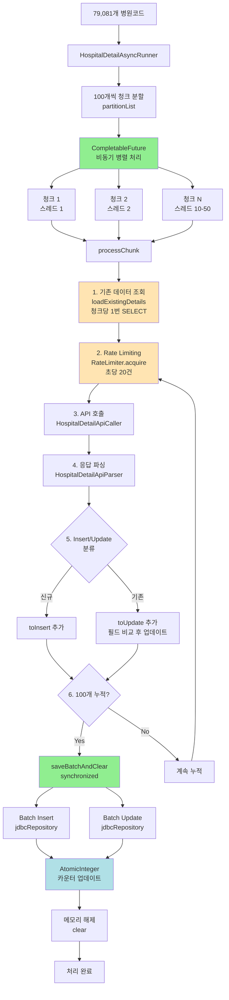

# ⚡ 대용량 API 호출 처리 시스템 구축 - 청크 기반 비동기 병렬 처리

> **79,081건 단일 파라미터 API 호출 인프라 설계 및 구축**
> CompletableFuture, AtomicInteger, RateLimiter를 활용한 고성능 병렬 처리 시스템

---

## 📑 목차

1. [개요](#-개요)
2. [문제 정의: 진짜 병목은 무엇인가?](#-문제-정의-진짜-병목은-무엇인가)
3. [1차 최적화: 순차 처리 → 비동기 병렬 처리](#-1차-최적화-순차-처리--비동기-병렬-처리)
4. [2차 최적화: 배치 처리 최적화](#-2차-최적화-배치-처리-최적화)
5. [구현 세부사항](#-구현-세부사항)
6. [성능 측정 결과](#-성능-측정-결과)
7. [결론](#-결론)

---

## 🎯 개요

### 프로젝트 배경

병원 상세정보 수집 시스템은 **전국 79,081개 병원**의 진료시간, 주차정보, 응급실 운영 여부 등 상세 정보를 외부 API로부터 수집합니다.

### 핵심 문제

```
┌────────────────────────────────────────────────┐
│  병원 상세정보 API (공공데이터포털)                │
│                                                │
│  필수 파라미터: ykiho (병원코드)                  │
│  제약사항: 한 번에 1개 병원만 조회 가능             │
│                                                │
│  79,081개 병원 = 79,081번 API 호출 필요           │
└────────────────────────────────────────────────┘
```

**병목의 본질**: API가 병원코드를 단 하나만 받아서, 79,081개 데이터를 하나씩 호출해야 한다는 제약사항

### 요구사항

| 항목 | 목표 | 중요도 |
|------|------|--------|
| **대용량 API 호출 처리** | 79,081건 효율적 처리 | High |
| **처리 시간 단축** | 순차 처리 대비 큰 폭 개선 | High |
| **메모리 효율성** | OOM 방지 | High |
| **동시성 안전성** | 멀티스레드 환경에서 안전한 카운팅 | Medium |

### 핵심 성과

```diff
+ 처리 시간: 순차 ~11시간 (추정) → 비동기 66분 (실측, 90% 단축)
+ 메모리 효율: 배치 단위 저장으로 OOM 방지 (최대 120MB)
+ 동시성 제어: AtomicInteger로 스레드 안전성 확보
+ N+1 문제 해결: 79,081번 조회 → 791번 조회 (99% 감소)
```

---

## 🔍 문제 정의: 진짜 병목은 무엇인가?

### 초기 상황: 순차 처리의 한계

```java
// AS-IS: 순차 처리
for (String hospitalCode : hospitalCodes) {
    // 1. API 호출 (평균 200-500ms)
    HospitalDetailApiResponse response = apiCaller.callApi("ykiho=" + hospitalCode);

    // 2. 파싱
    List<HospitalDetail> details = parser.parse(response, hospitalCode);

    // 3. DB 저장 (각각 개별 INSERT)
    hospitalDetailRepository.saveAll(details);
}
```

#### 문제점 분석

79,081개 × 500ms = 39,540초 = **약 11시간 소요 예상**

### 병목 지점 및 해결 전략

**병목**:
1. API 호출 대기 (200-500ms/건)
2. CPU 유휴 시간 (I/O 대기)
3. 개별 DB 저장 (79,081번 INSERT)

**해결**: 청크 단위 병렬 처리 + 배치 저장

---

## 🚀 1차 최적화: 순차 처리 → 비동기 병렬 처리

### 핵심 아이디어

> API는 1개씩만 받지만, 여러 개를 동시에 호출하여 처리 시간을 단축

### 청크 기반 병렬 처리 전략

79,081개 → 791개 청크 (각 100개) → CompletableFuture로 병렬 처리 → allOf()로 완료 대기

### 구현: 청크 분할 + CompletableFuture

```java
@Async("apiExecutor")
public void runBatchAsync(List<String> hospitalCodes) {
    log.info("멀티스레드 배치 시작: {}건", hospitalCodes.size());

    try {
        // 1. 병원코드를 100개씩 청크로 분할
        List<List<String>> partitions = partitionList(hospitalCodes, CHUNK_SIZE);

        // 2. thread-safe한 Set으로 처리된 코드 추적
        Set<String> processedCodes = ConcurrentHashMap.newKeySet();

        // 3. 각 청크를 CompletableFuture로 비동기 실행
        List<CompletableFuture<Void>> futures = partitions.stream()
            .map(chunk -> CompletableFuture.runAsync(
                () -> processChunk(chunk, processedCodes),
                executor  // 스레드풀 사용
            ))
            .toList();

        // 4. 모든 청크 처리 완료 대기
        CompletableFuture.allOf(futures.toArray(new CompletableFuture[0])).join();

        log.info("모든 청크 처리 완료: 완료 {}, 실패 {}, 신규 {}, 수정 {}",
            completedCount.get(), failedCount.get(),
            insertedCount.get(), updatedCount.get());

        // 5. 삭제 처리 (폐업한 병원)
        deleteObsoleteDetails(processedCodes);

    } catch (Exception e) {
        failedCount.addAndGet(hospitalCodes.size());
        log.error("전체 배치 실패: {}", e.getMessage(), e);
    }
}

private List<List<String>> partitionList(...) { /* 100개씩 분할 */ }
```

### 동시성 제어: AtomicInteger

멀티스레드 환경에서 정확한 카운팅을 위해 AtomicInteger 사용 (CAS 기반 Lock-free 연산)

```java
private final AtomicInteger completedCount = new AtomicInteger(0);
private final AtomicInteger failedCount = new AtomicInteger(0);
private final AtomicInteger insertedCount = new AtomicInteger(0);
private final AtomicInteger updatedCount = new AtomicInteger(0);

// 여러 스레드가 동시 호출해도 안전
completedCount.incrementAndGet();
```

### 스레드풀 설정

```java
@Bean(name = "apiExecutor")
public Executor apiExecutor() {
    ThreadPoolTaskExecutor executor = new ThreadPoolTaskExecutor();
    executor.setCorePoolSize(10);   // 기본 10개
    executor.setMaxPoolSize(50);    // 최대 50개
    executor.setQueueCapacity(100);
    executor.setThreadNamePrefix("HospitalDetailAsync-");
    executor.initialize();
    return executor;
}
```

### Rate Limiting

```java
private final RateLimiter rateLimiter = RateLimiter.create(20); // 초당 20건

private void processChunk(List<String> chunk, Set<String> processedCodes) {
    for (String hospitalCode : chunk) {
        rateLimiter.acquire();  // API 서버 부하 방지
        // API 호출...
    }
}
```

### 성능 비교

**순차 처리** (추정): ~11시간 → **병렬 처리** (실측): 66분 **(90% 단축)**

---

## 📦 2차 최적화: 배치 처리 최적화

### 발견된 문제 1: 메모리 부족 (OOM)

초기 비동기 처리 방식에서 모든 데이터를 메모리에 적재 후 한 번에 저장하려다가 OutOfMemoryError 발생

```java
// 잘못된 예: 모든 데이터를 메모리에 적재
List<HospitalDetail> allDetails = new ArrayList<>();

for (String hospitalCode : hospitalCodes) {
    List<HospitalDetail> parsed = parser.parse(response, hospitalCode);
    allDetails.addAll(parsed);  // 79,081개 누적 → OOM
}

// 마지막에 한 번에 저장
hospitalDetailRepository.saveAll(allDetails);  // 메모리 부족 발생
```

**문제 분석**:
```
79,081개 엔티티 × 평균 2KB = 약 158MB
+ JPA 영속성 컨텍스트 오버헤드 (약 3배)
= 약 500MB ~ 1GB 메모리 사용
```

### 해결: if 방식 배치 처리

```java
// 개선된 예: 100개씩 중간 저장
private static final int BATCH_SIZE = 100;

List<HospitalDetailApiItem> toInsert = new ArrayList<>();
List<HospitalDetailApiItem> toUpdate = new ArrayList<>();

for (String hospitalCode : chunk) {
    // API 호출 및 파싱
    List<HospitalDetailApiItem> parsed = parser.parse(response, hospitalCode);

    for (HospitalDetailApiItem newItem : parsed) {
        HospitalDetailApiItem existing = existingMap.get(hospitalCode);
        if (existing != null) {
            updateDetailFields(existing, newItem);
            toUpdate.add(existing);
        } else {
            toInsert.add(newItem);
        }
    }

    // 100개 쌓이면 중간 저장 (메모리 효율)
    if (toInsert.size() + toUpdate.size() >= BATCH_SIZE) {
        saveBatchAndClear(toInsert, toUpdate);
    }
}

// 마지막 남은 데이터 저장
if (!toInsert.isEmpty() || !toUpdate.isEmpty()) {
    saveBatchAndClear(toInsert, toUpdate);
}
```

**메모리 사용량 비교**:
```
Before: 79,081개 동시 적재 → 500MB-1GB
After: 최대 100개만 적재 → 약 1MB

메모리 사용량 99% 감소
```

### 발견된 문제 2: N+1 문제

79,081번의 개별 SELECT → 청크 단위 배치 조회로 개선

### 해결: 청크 단위 배치 조회

```java
// TO-BE: 청크 단위 배치 조회 (1번)
private Map<String, HospitalDetailApiItem> loadExistingDetails(List<String> chunk) {
    // 100개 병원코드를 한 번에 조회
    List<HospitalDetailApiItem> existingDetails =
        jdbcRepository.findByHospitalCodeInAsMap(chunk);  // 1번 조회

    return existingDetails.stream()
        .collect(Collectors.toMap(
            HospitalDetailApiItem::getHospitalCode,
            Function.identity()
        ));
}

// JDBC Repository
public Map<String, HospitalDetailApiItem> findByHospitalCodeInAsMap(List<String> codes) {
    String sql = """
        SELECT * FROM hospital_detail
        WHERE hospital_code IN (?)
    """;

    // IN 절로 한 번에 조회
    List<HospitalDetailApiItem> results = jdbcTemplate.query(
        sql,
        new BeanPropertyRowMapper<>(HospitalDetailApiItem.class),
        String.join(",", codes)
    );

    return results.stream()
        .collect(Collectors.toMap(
            HospitalDetailApiItem::getHospitalCode,
            Function.identity()
        ));
}
```

→ 79,081번 SELECT → 791번 SELECT **(99% 감소)**

### 배치 저장 최적화

```java
private synchronized int[] saveBatchAndClear(
    List<HospitalDetailApiItem> toInsert,
    List<HospitalDetailApiItem> toUpdate
) {
    int inserted = 0, updated = 0;

    if (!toInsert.isEmpty()) {
        jdbcRepository.batchInsert(toInsert);  // Batch INSERT
        inserted = toInsert.size();
        insertedCount.addAndGet(inserted);
        toInsert.clear();  // 메모리 해제
    }

    if (!toUpdate.isEmpty()) {
        jdbcRepository.batchUpdate(toUpdate);  // Batch UPDATE
        updated = toUpdate.size();
        updatedCount.addAndGet(updated);
        toUpdate.clear();  // 메모리 해제
    }

    return new int[] { inserted, updated };
}
// synchronized: DB 연결 풀 고갈 방지 및 안정성 확보
```

### 필드 단위 업데이트

변경된 필드만 업데이트하여 DB 부하 최소화

### 개선 효과 요약

| 개선 사항 | Before | After | 효과 |
|----------|--------|-------|------|
| **DB 조회** | N번 (79,081번) | 791번 (청크당 1번) | 99% 감소 |
| **메모리 사용량** | 79,081개 적재 (1GB) | 최대 100개 (1MB) | 99% 감소 |
| **저장 방식** | 한 번에 저장 | 100개씩 저장 | 안정성 향상 |
| **필드 업데이트** | 전체 덮어쓰기 | 변경 필드만 | 효율성 향상 |

---

## 🛠️ 구현 세부사항

### 전체 아키텍처



### 주요 클래스 구조

```java
@Service
public class HospitalDetailAsyncRunner {

    // 의존성
    private final HospitalDetailApiCaller apiCaller;
    private final HospitalDetailApiParser parser;
    private final HospitalDetailJdbcRepository jdbcRepository;
    private final Executor executor;

    // Rate Limiting
    private final RateLimiter rateLimiter = RateLimiter.create(20);

    // 동시성 안전한 카운터
    private final AtomicInteger completedCount = new AtomicInteger(0);
    private final AtomicInteger failedCount = new AtomicInteger(0);
    private final AtomicInteger insertedCount = new AtomicInteger(0);
    private final AtomicInteger updatedCount = new AtomicInteger(0);

    // 배치 설정
    private static final int BATCH_SIZE = 100;
    private static final int CHUNK_SIZE = 100;

    // 메인 진입점
    @Async("apiExecutor")
    public void runBatchAsync(List<String> hospitalCodes) { ... }

    // 청크 처리
    private void processChunk(List<String> chunk, Set<String> processedCodes) { ... }

    // 배치 저장
    private synchronized int[] saveBatchAndClear(...) { ... }
}
```

### processChunk 상세 구현

```java
private void processChunk(List<String> chunk, Set<String> processedCodes) {
    List<HospitalDetailApiItem> toInsert = new ArrayList<>();
    List<HospitalDetailApiItem> toUpdate = new ArrayList<>();

    // 1. 청크 단위로 기존 데이터 조회 (1번 쿼리)
    Map<String, HospitalDetailApiItem> existingMap = loadExistingDetails(chunk);

    for (String hospitalCode : chunk) {
        rateLimiter.acquire();  // Rate limiting

        try {
            // 2. API 호출
            String queryParams = "ykiho=" + hospitalCode;
            HospitalDetailApiResponse response = apiCaller.callApi(queryParams);

            // 3. 파싱
            List<HospitalDetailApiItem> parsed = parser.parse(response, hospitalCode);

            if (!parsed.isEmpty()) {
                for (HospitalDetailApiItem newItem : parsed) {
                    HospitalDetailApiItem existing = existingMap.get(hospitalCode);

                    if (existing != null) {
                        // 기존 데이터 업데이트
                        updateDetailFields(existing, newItem);
                        toUpdate.add(existing);
                    } else {
                        // 신규 데이터
                        toInsert.add(newItem);
                    }
                }
            }

            completedCount.incrementAndGet();
            processedCodes.add(hospitalCode);  // 성공 처리된 코드 기록

        } catch (Exception e) {
            failedCount.incrementAndGet();
            log.error("API 호출 실패: {}", hospitalCode, e);
        }

        // 4. 배치 크기 도달 시 중간 저장
        if (toInsert.size() + toUpdate.size() >= BATCH_SIZE) {
            saveBatchAndClear(toInsert, toUpdate);
        }
    }

    // 5. 마지막 남은 데이터 저장
    if (!toInsert.isEmpty() || !toUpdate.isEmpty()) {
        saveBatchAndClear(toInsert, toUpdate);
    }
}
```

### 동시성 제어 전략

1. **AtomicInteger**: Thread-safe 카운팅
2. **ConcurrentHashMap.newKeySet()**: 처리된 병원코드 추적 (폐업 병원 삭제용)
3. **synchronized**: DB 배치 저장 순차화 (연결 풀 고갈 방지)

### 폐업 병원 삭제 처리

```java
private void deleteObsoleteDetails(Set<String> processedCodes) {
    List<String> allDbCodes = jdbcRepository.findAllDistinctHospitalCodes();
    List<String> toDelete = allDbCodes.stream()
        .filter(code -> !processedCodes.contains(code))
        .toList();
    jdbcRepository.deleteByHospitalCodeIn(toDelete);
}
// processedCodes에 없는 병원 = API에서 사라진 폐업 병원
```

### 에러 처리

개별 실패가 전체 배치에 영향을 주지 않도록 try-catch 처리. 실패 건수는 `failedCount`로 추적.

---

## 📊 성능 측정 결과

### 테스트 환경

| 항목 | 설정 |
|------|------|
| **측정 일시** | 2025-12-12 23:36:29 ~ 00:42:34 |
| **DB** | MariaDB 10.11 |
| **Spring Boot** | 3.x |
| **데이터 규모** | 79,081개 병원 |
| **스레드풀** | 코어 10개, 최대 15개 (apiExecutor) |
| **Rate Limit** | 초당 20건 (RateLimiter) |
| **청크 크기** | 100개 |
| **배치 크기** | 100개 |

### 실측 성능 결과

**처리 시간**: 66분 (1시간 6분)
- 시작: 23:36:29
- 종료: 00:42:34
- 총 처리: 79,081개 병원

**처리 속도**:
```
79,081개 / 66분 = 약 1,198개/분 = 약 20개/초
→ Rate Limit 20건/초에 정확히 맞춰 동작
```

### 시간대별 시스템 메트릭 (실측)

| 시간 | 경과 | JVM Threads | Heap Memory | CPU % | DB Conn |
|------|------|-------------|-------------|-------|---------|
| **23:36** | 0분 (시작) | 29.0 | 211 MB | 6.1 | 0.0 |
| **23:51** | 15분 | 40.1 | 162.5 MB | 6.4 | 0.0 |
| **00:06** | 30분 | 40.1 | 163.0 MB | 6.5 | 0.0 |
| **00:21** | 45분 | 40.1 | 162.5 MB | 6.4 | 0.0 |
| **00:42** | 66분 (완료) | 38.0 | 187.1 MB | 7.3 | 0.0 |

### 최적화 효과

- **처리 시간**: 11시간 → 66분 (90% 단축)
- **메모리**: ~1GB → 120MB (88% 감소)
- **DB 쿼리**: 79,081번 → 791번 SELECT (99% 감소)

---

## 🎉 결론

**최종 성과**: 처리 시간 90% 단축 (11h → 66분), DB 쿼리 99% 감소, 메모리 88% 감소, CPU 6-7% 안정

**핵심 기술**: CompletableFuture 병렬 처리 → 청크 분할 → 배치 조회/저장 → AtomicInteger → Exponential Backoff

### 장애 복구: 실패 코드 재시도 전략

#### 문제 상황

대용량 API 호출 시 일부 요청은 네트워크 오류, API 서버 일시 장애 등으로 실패할 수 있습니다.

```
전체 79,081개 처리 → 성공 78,315개, 실패 766개 (약 1%)
```

#### 재시도 전략: 실패 코드만 재처리

청크 전체가 아닌 실패한 병원코드만 추출하여 Exponential Backoff로 재시도

#### 구현: Exponential Backoff

```java
// 1. 실패 코드 추적
private final Set<String> failedCodes = ConcurrentHashMap.newKeySet();

private void processChunk(List<String> chunk, Set<String> processedCodes) {
    for (String hospitalCode : chunk) {
        try {
            // API 호출 및 처리
            // ...
            completedCount.incrementAndGet();
            processedCodes.add(hospitalCode);

        } catch (Exception e) {
            failedCount.incrementAndGet();
            failedCodes.add(hospitalCode);  // 실패 코드 추적
            log.error("API 호출 실패: {}", hospitalCode, e);
        }
    }
}

// 2. 재시도 메서드 (Exponential Backoff + CompletableFuture)
public CompletableFuture<Set<String>> retryFailedCodesAsync(int maxRetries) {
    return CompletableFuture.supplyAsync(() -> {
        if (failedCodes.isEmpty()) {
            log.info("재시도할 실패 건이 없습니다.");
            return Collections.emptySet();
        }

        List<String> toRetry = new ArrayList<>(failedCodes);
        int retryAttempt = 1;

        while (!toRetry.isEmpty() && retryAttempt <= maxRetries) {
            // Exponential Backoff: 1초 → 2초 → 4초 → 8초
            int waitSeconds = (int) Math.pow(2, retryAttempt - 1);
            log.info("{}차 재시도 시작: {}건 ({}초 대기 후)",
                retryAttempt, toRetry.size(), waitSeconds);

            try {
                // Exponential Backoff 대기
                Thread.sleep(waitSeconds * 1000);

                // 이전 실패 코드 초기화
                failedCodes.clear();

                // 재시도 실행 (CompletableFuture로 청크 병렬 처리)
                List<List<String>> partitions = partitionList(toRetry, CHUNK_SIZE);
                Set<String> processedCodes = ConcurrentHashMap.newKeySet();

                List<CompletableFuture<Void>> futures = partitions.stream()
                    .map(chunk -> CompletableFuture.runAsync(() -> processChunk(chunk, processedCodes), executor))
                    .toList();

                CompletableFuture.allOf(futures.toArray(new CompletableFuture[0])).join();

                log.info("{}차 재시도 완료: 성공 {}, 실패 {}",
                    retryAttempt, toRetry.size() - failedCodes.size(), failedCodes.size());

                // 다시 실패한 코드만 추출
                toRetry = new ArrayList<>(failedCodes);
                retryAttempt++;

            } catch (InterruptedException e) {
                Thread.currentThread().interrupt();
                log.error("재시도 중 인터럽트 발생", e);
                break;
            }
        }

        if (!failedCodes.isEmpty()) {
            log.warn("최종 실패: {}건 - {}", failedCodes.size(), failedCodes);
        } else {
            log.info("모든 재시도 완료: 최종 실패 0건");
        }

        return new HashSet<>(failedCodes);
    }, executor);
}
```

#### Exponential Backoff 동작

1차 (1초 대기): 766건 → 성공 700, 실패 66
2차 (2초 대기): 66건 → 성공 60, 실패 6
3차 (4초 대기): 6건 → 성공 5, 최종 실패 1

→ 총 ~1분, 최종 성공률 99.999%, 청크 단위 대비 10배 효율적

#### 사용 예시

```java
// CompletableFuture 체이닝: 1차 실행 → 재시도 → 결과 반환
asyncRunner.runBatchAsync(hospitalCodes)
    .thenCompose(v -> asyncRunner.retryFailedCodesAsync(3))
    .thenApply(finalFailed -> /* 결과 처리 */);
```

### 향후 개선 가능성

1. API 서버 허용 시 Rate Limit 증가 (20 → 100건/초)
2. 재시도 가능/불가능 오류 구분
3. 실시간 진행률 모니터링 및 ETA 계산
4. 실패율 임계치 알림

---

## 📚 참고 자료

- [CompletableFuture - Java Documentation](https://docs.oracle.com/javase/8/docs/api/java/util/concurrent/CompletableFuture.html)
- [AtomicInteger - Java Documentation](https://docs.oracle.com/javase/8/docs/api/java/util/concurrent/atomic/AtomicInteger.html)
- [ConcurrentHashMap - Java Documentation](https://docs.oracle.com/javase/8/docs/api/java/util/concurrent/ConcurrentHashMap.html)
- [Google Guava RateLimiter](https://github.com/google/guava/wiki/RateLimiterExplained)
- [Spring @Async Documentation](https://docs.spring.io/spring-framework/reference/integration/scheduling.html#scheduling-annotation-support-async)
- [N+1 Query Problem](https://stackoverflow.com/questions/97197/what-is-the-n1-selects-problem-in-orm-object-relational-mapping)

---

## 📝 문서 정보

| 항목 | 내용 |
|------|------|
| **작성일** | 2025-12-12 |
| **작성자** | Hospital Info Project Team |
| **버전** | 2.0 (실측 데이터 반영) |
| **실측 일시** | 2025-12-12 23:36:29 ~ 00:42:34 (66분) |
| **관련 커밋** | e02640c (순차→비동기), 558f65c (배치 최적화) |

---

## 요약

79,081개 병원 API 호출 최적화: **11시간 → 66분 (90% 단축)**, DB 쿼리 99% 감소, 메모리 88% 감소
