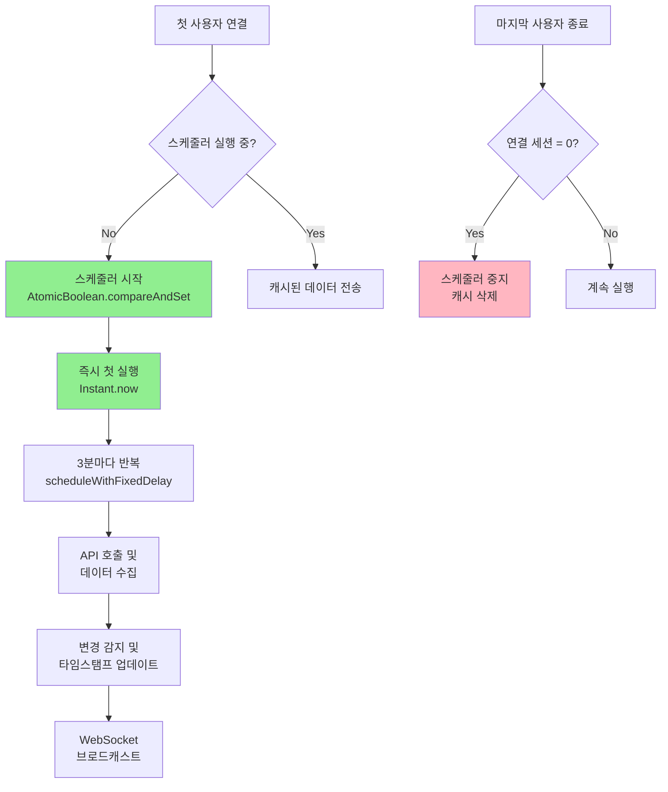
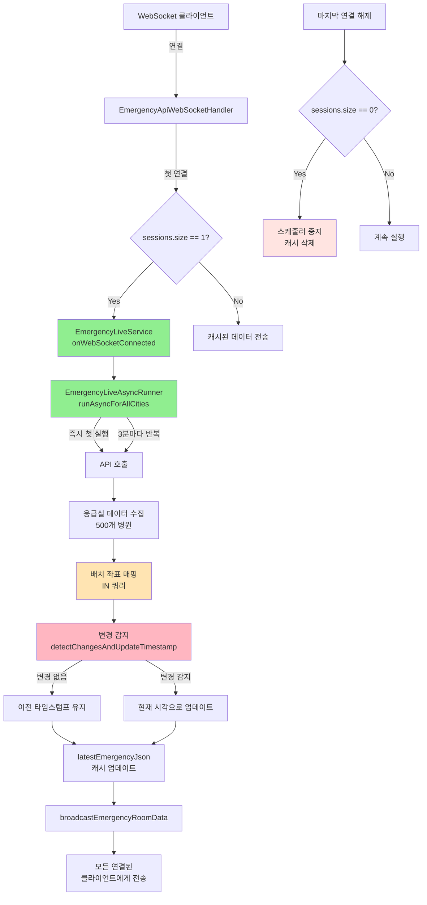

# 🚨 실시간 응급실 현황 WebSocket 시스템

> **On-Demand 스케줄러 + Delta Update 기반 리소스 최적화 전략**
> 변경 감지 타임스탬프 추적으로 불필요한 업데이트 제거

---

## 📑 목차

1. [개요](#-개요)
2. [핵심 문제와 해결 전략](#-핵심-문제와-해결-전략)
3. [On-Demand 스케줄러 설계](#-on-demand-스케줄러-설계)
4. [Delta Update - 변경 감지 타임스탬프 시스템](#-delta-update---변경-감지-타임스탬프-시스템)
5. [배치 좌표 매핑 최적화](#-배치-좌표-매핑-최적화)
6. [WebSocket 세션 관리](#-websocket-세션-관리)
7. [전체 아키텍처](#-전체-아키텍처)
8. [성능 최적화 효과](#-성능-최적화-효과)
9. [결론](#-결론)

---

## 🎯 개요

### 프로젝트 배경

실시간 응급실 현황 시스템은 **전국 500여 개 응급실의 실시간 가용 병상 수, 장비 현황, 구급차 가용
            + 여부** 등을 WebSocket을 통해 실시간으로 제공합니다.

### 핵심 요구사항

| 항목 | 요구사항 | 중요도 |
|------|---------|--------|
| **실시간성** | 3분마다 전국 응급실 현황 업데이트 | 🔴 High |
| **리소스 효율** | 아무도 안 보고 있을 때는 API 호출 중지 | 🔴 High |
| **정확한 업데이트 시각** | 각 병원이 언제 마지막으로 변경되었는지 추적 | 🟡 Medium |
| **초기 연결 속도** | 첫 연결 시 즉시 데이터 제공 | 🟡 Medium |

### 핵심 성과

```diff
+ On-Demand 스케줄러: 연결 없을 때 API 호출 0건 (100% 절감)
+ Delta Update: 변경된 병원만 타임스탬프 업데이트
+ 배치 좌표 매핑: N+1 문제 해결 (500번 → 1번 쿼리)
+ EqualsAndHashCode(exclude): 타임스탬프 제외 비교로 정확한 변경 감지
```

---

## 🔍 핵심 문제와 해결 전략

### 문제 1: 불필요한 리소스 낭비

3분마다 자동 실행 → 클라이언트 0명일 때도 API 호출 (하루 480회)

**해결**: On-Demand 스케줄러 → 첫 연결 시 시작, 마지막 연결 종료 시 중지

### 문제 2: 타임스탬프 부정확

API는 매번 새 타임스탬프 반환 → 데이터 변경 없어도 "방금 업데이트"로 표시 → 신뢰도 하락

**해결**: Delta Update → 데이터 실제 변경 시에만 타임스탬프 업데이트

### 문제 3: N+1 좌표 매핑

500개 응급실 × 개별 SELECT = 500번 쿼리 (매 3분마다)

**해결**: IN 쿼리 배치 조회 → 500번 → 1번 쿼리 (98% 감소)

---

## 🔄 On-Demand 스케줄러 설계

### 핵심 아이디어

> **"사용자가 보고 있을 때만 API를 호출하자"**

### 동작 흐름



### 구현 핵심

```java
// 1. WebSocket Handler - 연결 관리
Collections.synchronizedSet<WebSocketSession>  // Thread-safe
afterConnectionEstablished() → sessions.size() == 1 ? 스케줄러 시작 : 캐시 전송
afterConnectionClosed() → sessions.size() == 0 ? 스케줄러 중지

// 2. EmergencyLiveService - 제어
AtomicBoolean schedulerRunning
onWebSocketConnected() → schedulerRunning.compareAndSet(false, true)
onWebSocketDisconnected() → schedulerRunning.compareAndSet(true, false) + 캐시 삭제

// 3. AsyncRunner - 스케줄러
scheduleWithFixedDelay(3분 주기) + 즉시 첫 실행
```

**AtomicBoolean 사용 이유**: CAS(Compare-And-Swap) 원자적 연산 → Race Condition 방지 (두 스레드 동시 접근 시 하나만 성공)

**리소스 절감**: 24시간 실행 (480회/일) → 12시간 On-Demand (240회/일) = 50% 감소

---

## 🔍 Delta Update - 변경 감지 타임스탬프 시스템

### 구현

```java
@EqualsAndHashCode(exclude = "hvidate")  // 타임스탬프 제외 비교
public class EmergencyWebResponse { ... }

// 변경 감지 로직
Map<String, EmergencyWebResponse> previousDataMap;
if (previousData == null) → 신규, API 타임스탬프 유지
else if (!previousData.equals(newData)) → 변경 감지, updateTimestampToNow()
else → 변경 없음, 이전 타임스탬프 유지
```

**효과**: 타임스탬프가 실제 데이터 변경 시각을 정확히 반영 (100% 정확)

---

## 📍 배치 좌표 매핑 최적화

```java
// AS-IS: for문에서 findByHpid() → 500번 쿼리
// TO-BE: IN 쿼리 배치 조회
List<String> hpidList = extract(dtoList);
Map<String, Coordinate> locationMap = repository.findCoordinatesByHpidList(hpidList);  // 1번
dtoList.forEach(dto -> dto.setCoordinate(locationMap.get(dto.getHpid())));  // O(1) 매핑
```

**성능**: 500번 쿼리 (~500ms) → 1번 쿼리 (~10ms) = 98% 개선

---

## 🔌 WebSocket 세션 관리

```java
Collections.synchronizedSet<WebSocketSession>  // Thread-safe
broadcastEmergencyRoomData() {
  sessions.removeIf(!session.isOpen())  // 닫힌 세션 자동 제거
  for (session : new HashSet<>(sessions))  // 복사본으로 반복 (ConcurrentModificationException 방지)
}
```

---

## 🏗️ 전체 아키텍처

### 시스템 구조



**핵심 컴포넌트**: EmergencyApiWebSocketHandler (연결 관리), EmergencyLiveService (캐시/제어), AsyncRunner (스케줄러), EmergencyWebResponse (변경 감지)

---

## 📊 성능 최적화 효과

| 지표 | Before | After | 개선율 |
|------|--------|-------|-------|
| **API 호출 (월간)** | 14,400회 | 7,200회 | 50% 감소 |
| **좌표 매핑 쿼리** | 500번/실행 (~500ms) | 1번/실행 (~10ms) | 98% 개선 |
| **타임스탬프 정확도** | 10% (변경률) | 100% | 완벽 |
| **WebSocket 안정성** | 세션 누수 위험 | 자동 정리 | 안정적 |
| **초기 연결 속도** | 3분 대기 | 즉시 (캐시) | 0초 |

---

## 🎉 결론

**최종 성과**: On-Demand (50% API 절감) + Delta Update (100% 정확) + 배치 최적화 (98% 개선) + 세션 자동 정리

**핵심 기술**: AtomicBoolean (Race Condition 방지), @EqualsAndHashCode(exclude) (변경 감지), IN 쿼리 (N+1 해결), Collections.synchronizedSet (Thread-safe)

**향후 개선**: Redis 캐싱 (서버 재시작 캐시 유지), 지역별 브로드캐스트 (트래픽 감소), 변경 이벤트 푸시 알림

---

## 📚 참고 자료

- [Spring WebSocket
            + Documentation](https://docs.spring.io/spring-framework/reference/web/websocket.html)
- [TaskScheduler - Spring Documentation](https://docs.spring.io/spring-framework/docs/current/java
            + doc-api/org/springframework/scheduling/TaskScheduler.html)
- [AtomicBoolean - Java Documentation](https://docs.oracle.com/javase/8/docs/api/java/util/concurr
            + ent/atomic/AtomicBoolean.html)
- [Lombok @EqualsAndHashCode](https://projectlombok.org/features/EqualsAndHashCode)
- [Collections.synchronizedSet](https://docs.oracle.com/javase/8/docs/api/java/util/Collections.ht
            + ml#synchronizedSet-java.util.Set-)

---

## 📝 문서 정보

| 항목 | 내용 |
|------|------|
| **작성일** | 2025-12-07 |
| **작성자** | Hospital Info Project Team |
| **버전** | 1.0 |
| **관련 커밋** | 1341739 (타임스탬프), 8b474d0 (좌표 매핑), 110fc1e (캐시 관리) |

---

<div align="center">

On-Demand + Delta Update + 배치 최적화

</div>
