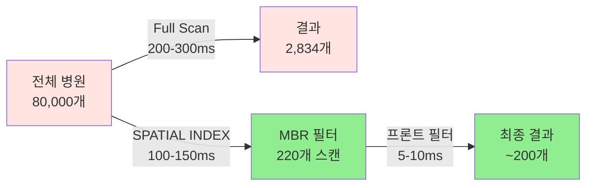
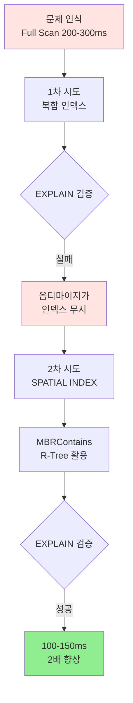

# 🗺️ 공간 인덱스 기반 병원 검색 최적화

> **복합 인덱스의 한계를 극복하고 MBR 기반 2단계 필터링으로 2배 성능 향상**
> ST_Distance_Sphere 원형 필터링의 함정부터 SPATIAL INDEX 최적화까지

---

## 📑 목차

1. [개요](#-개요)
2. [초기 구현: ST_Distance_Sphere의 함정](#-초기-구현-st_distance_sphere의-함정)
3. [1차 최적화: 복합 인덱스 시도](#-1차-최적화-복합-인덱스-시도)
4. [복합 인덱스가 작동하지 않은 이유](#-복합-인덱스가-작동하지-않은-이유)
5. [2차 최적화: SPATIAL INDEX + MBR 전략](#-2차-최적화-spatial-index--mbr-전략)
6. [EXPLAIN으로 검증하기](#-explain으로-검증하기)
7. [프론트엔드 원형 필터링 결정](#-프론트엔드-원형-필터링-결정)
8. [성능 측정 결과](#-성능-측정-결과)
9. [결론](#-결론)

---

## 🎯 개요

### 프로젝트 배경

위치 기반 병원 검색 시스템에서 사용자 위치 기준 **반경 3km 내 병원을 검색**하는 API를 개발했습니다.
전국 약 **8만 개 병원 데이터**에서 빠르게 검색하기 위해서는 **인덱스 최적화**가 필수였습니다.

### 왜 최적화가 필요했는가?

단일 요청에서는 200-300ms 응답 시간이 크게 문제되지 않을 수 있습니다. 하지만 **실제 운영 환경**에서는 다른 문제가 발생합니다.

#### 동시 접속자 부하 문제

```
단일 요청 (1명):
┌─────────────────────────────────────┐
│ Full Scan: 80,000행 스캔            │
│ 응답 시간: 200ms                    │
│ DB 부하: 보통                       │
└─────────────────────────────────────┘

동시 요청 (100명):
┌─────────────────────────────────────┐
│ Full Scan: 80,000행 × 100 = 8,000,000행  │  ← ❌ 문제!
│ DB CPU: 급격히 상승                 │
│ 쿼리 대기 시간: 증가                │
│ 컨테이너 안정성: 위험               │
└─────────────────────────────────────┘
     ↓
┌─────────────────────────────────────┐
│ SPATIAL INDEX: 220행 × 100 = 22,000행     │  ← ✅ 해결!
│ DB CPU: 안정적                      │
│ 쿼리 대기 시간: 최소화              │
│ 컨테이너 안정성: 확보               │
└─────────────────────────────────────┘
```

**핵심 문제**:
- Full Scan은 동시 접속자가 늘어날수록 **DB 부하가 기하급수적으로 증가**
- 80,000행을 반복적으로 스캔하면 **CPU 과부하**로 응답 시간 급증
- 최악의 경우 **컨테이너 다운** 위험

**최적화 목표**:
- 단일 요청 성능 향상 (200ms → 100ms)
- **동시 다중 요청 환경에서 안정적인 처리**
- **컨테이너 안정성 확보**

### 기술 스택

| 항목 | 기술 |
|------|------|
| **DB** | MariaDB 10.11 |
| **Framework** | Spring 6.0.13 (순수 Spring) |
| **ORM** | JPA 3.0.11 → JDBC |
| **공간 함수** | ST_Distance_Sphere, MBRContains |
| **인덱스** | SPATIAL INDEX (R-Tree) |

### 핵심 성과

```diff
+ 응답 시간: 200-300ms → 100-150ms (2배 향상 ✅)
+ 스캔 행 수: 80,000행 → 220행 (99.72% 감소 ✅)
+ Full Table Scan 제거: 공간 인덱스 활용 (EXPLAIN 검증 ✅)
+ 동시 접속자 환경 대비: 컨테이너 안정성 확보 ✅
+ 프론트엔드 협업: 원형 필터링 역할 분담으로 효율 극대화 ✅
```

---

## ⚠️ 초기 구현: ST_Distance_Sphere의 함정

### 초기 쿼리

```sql
SELECT h.*
FROM hospital_main h
WHERE ST_Distance_Sphere(
          POINT(h.coordinate_x, h.coordinate_y),
          POINT(:lon, :lat)
      ) <= :radius * 1000
  AND h.coordinate_x IS NOT NULL
  AND h.coordinate_y IS NOT NULL
```

### 쿼리 의도

> **"사용자 위치에서 반경 3km 이내의 병원만 가져오기"**

- `ST_Distance_Sphere`: 구면 거리 계산 (지구가 구형이라는 것을 고려)
- `POINT(x, y)`: 좌표를 공간 객체로 변환
- `:radius * 1000`: km → m 단위 변환

### 문제점 1: Full Table Scan

```
┌──────────────────────────────────────────┐
│ EXPLAIN 결과                             │
├──────────────────────────────────────────┤
│ type: ALL                                │  ← ❌ Full Scan!
│ rows: 80,000                             │  ← 전체 테이블 스캔
│ Extra: Using where                       │
└──────────────────────────────────────────┘
```

**왜 Full Scan이 발생했을까?**

> **공간 함수 `ST_Distance_Sphere`는 인덱스를 전혀 사용하지 못함!**

#### 인덱스를 사용할 수 없는 이유

```sql
-- ❌ 인덱스 불가: 함수가 컬럼을 감싸고 있음
WHERE ST_Distance_Sphere(POINT(x, y), POINT(:lon, :lat)) <= 3000

-- ✅ 인덱스 가능: 컬럼이 직접 비교됨
WHERE x BETWEEN :minLon AND :maxLon
```

**원칙**:
- 인덱스는 **컬럼 값 자체**를 비교할 때만 사용 가능
- `ST_Distance_Sphere(컬럼, ...)`처럼 **함수로 감싼 컬럼**은 인덱스 불가
- 모든 행을 읽어서 함수를 실행한 뒤 조건 체크 → **Full Scan 불가피**

### 문제점 2: 비효율적인 원형 필터링

```
┌─────────────────────────────────────┐
│  사용자 위치 (37.5, 127.0)          │
│                                     │
│       ●─────────●                   │  원형 거리 계산은
│      /  3km      \                  │  모든 행에 대해
│     ●             ●                 │  복잡한 구면 기하
│    |               |                │  계산 수행
│     ●             ●                 │
│      \           /                  │  → 매우 느림! ❌
│       ●─────────●                   │
└─────────────────────────────────────┘

계산 비용:
- 구면 삼각법 (Haversine 또는 Vincenty)
- sin, cos, atan2 연산
- 80,000행 × 복잡한 계산 = 엄청난 CPU 부하
```

### 성능 측정 결과

| 항목 | 수치 |
|------|------|
| 응답 시간 | **200-300ms** ❌ |
| EXPLAIN type | **ALL (Full Scan)** ❌ |
| 스캔 행 수 | **80,000행** ❌ |
| CPU 사용 | 높음 (구면 거리 계산) ❌ |

---

## 🔧 1차 최적화: 복합 인덱스 시도

### 전략: 2단계 필터링

> **"먼저 사각형으로 빠르게 걸러내고, 그 안에서 원형으로 정확하게 필터링하자"**

```
┌────────────────────────────────────────┐
│  1단계: 사각형 필터 (BETWEEN)          │  ← 인덱스 사용 가능!
│  ┌──────────────────┐                  │
│  │ ●   ●   ●   ●   │                  │
│  │   ●   ●   ●     │                  │
│  │ ●   ●   ●   ●   │                  │
│  │   ●   ●   ●     │                  │
│  └──────────────────┘                  │
│         ↓                              │
│  2단계: 원형 필터 (ST_Distance)        │  ← 후보만 계산
│        ●─────●                          │
│       /       \                        │
│      ●    ●    ●                       │
│       \       /                        │
│        ●─────●                          │
└────────────────────────────────────────┘
```

### 구현 코드

#### 1. 복합 인덱스 생성

```sql
-- coordinate_x, coordinate_y 복합 인덱스 추가
CREATE INDEX idx_coordinates
ON hospital_main (coordinate_x, coordinate_y);
```

#### 2. 2단계 쿼리 작성

```sql
SELECT h.*
FROM hospital_main h
WHERE h.coordinate_x BETWEEN :minLon AND :maxLon  -- 1단계: 사각형 (인덱스)
  AND h.coordinate_y BETWEEN :minLat AND :maxLat
  AND ST_Distance_Sphere(                          -- 2단계: 원형 (정확도)
      POINT(h.coordinate_x, h.coordinate_y),
      POINT(:lon, :lat)
  ) <= :radius
```

#### 3. 바운딩 박스 계산 (Service Layer)

```java
public List<HospitalWebResponse> getHospitals(
    double userLat, double userLng, double radius
) {
    double radiusMeters = radius * 1000;

    // 위도 1도 ≈ 111.32km (고정)
    double latDegree = radiusMeters / 111320.0;

    // 경도 1도 거리는 위도에 따라 변함 (위도가 높을수록 짧아짐)
    double lonDegree = radiusMeters / (111320.0 * Math.cos(Math.toRadians(userLat)));

    List<HospitalMain> hospitalEntities = hospitalMainApiRepository
        .findHospitalsWithinBoundingBox(
            userLat,                    // lat
            userLng,                    // lon
            radiusMeters,               // radius
            userLat - latDegree,        // minLat
            userLat + latDegree,        // maxLat
            userLng - lonDegree,        // minLon
            userLng + lonDegree         // maxLon
        );

    return hospitalEntities.stream()
        .map(hospitalConverter::convertToDTO)
        .collect(Collectors.toList());
}
```

### 기대 효과

```
✅ coordinate_x BETWEEN: 인덱스로 빠르게 필터링
✅ coordinate_y BETWEEN: 인덱스로 빠르게 필터링
✅ ST_Distance_Sphere: 후보 행에만 적용 (부하 감소)
```

---

## ❌ 복합 인덱스가 작동하지 않은 이유

### EXPLAIN 결과: 충격적인 현실

```sql
EXPLAIN SELECT h.*
FROM hospital_main h
WHERE h.coordinate_x BETWEEN 126.9 AND 127.1
  AND h.coordinate_y BETWEEN 37.4 AND 37.6
  AND ST_Distance_Sphere(...) <= 3000;
```

```
┌──────────────────────────────────────────┐
│ EXPLAIN 결과                             │
├──────────────────────────────────────────┤
│ type: ALL                                │  ← ❌ 여전히 Full Scan!
│ possible_keys: idx_coordinates           │  ← 인덱스는 인식함
│ key: NULL                                │  ← 하지만 사용 안 함!
│ rows: 100,000                            │  ← 전체 스캔
│ Extra: Using where                       │
└──────────────────────────────────────────┘
```

### 왜 인덱스를 사용하지 않았을까?

#### 원인 1: MySQL/MariaDB 옵티마이저의 한계

> **복합 인덱스는 WHERE 절에 컬럼이 "등호(=)" 또는 "범위(BETWEEN)"로 연결될 때 가장 효율적**

**복합 인덱스 활용 조건**

```sql
-- ✅ 이상적: 첫 번째 컬럼이 등호
WHERE coordinate_x = 127.0 AND coordinate_y BETWEEN 37.4 AND 37.6

-- ⚠️ 비효율: 둘 다 범위 (두 번째 컬럼 인덱스 제대로 활용 못함)
WHERE coordinate_x BETWEEN 126.9 AND 127.1
  AND coordinate_y BETWEEN 37.4 AND 37.6
```

**우리의 경우**:
- `coordinate_x BETWEEN` **AND** `coordinate_y BETWEEN`
- 두 컬럼 모두 범위 검색 → 복합 인덱스 효율 ↓

#### 원인 2: 옵티마이저의 Cost 계산

```
MariaDB 옵티마이저가 판단한 비용:

[인덱스 스캔 비용]
  - idx_coordinates로 BETWEEN 필터링: 예상 40,000행
  - 40,000행에 대해 ST_Distance_Sphere 계산
  - 비용: 인덱스 I/O + 40,000 × (복잡한 계산)

[Full Scan 비용]
  - 전체 80,000행 순차 스캔
  - ST_Distance_Sphere는 어차피 계산해야 함
  - 비용: 순차 I/O (빠름) + 80,000 × (복잡한 계산)

→ 옵티마이저 판단: "Full Scan이 더 빠르겠는데?" 🤔
→ idx_coordinates 사용 안 함 ❌
```

**핵심**:
- `BETWEEN` 범위가 넓으면 → 인덱스로 줄어드는 행 수가 적음
- `ST_Distance_Sphere` 계산 비용이 너무 큼
- 옵티마이저가 "Full Scan + 순차 I/O"가 더 낫다고 판단

#### 원인 3: WHERE 절 동적 파라미터

```sql
-- 사용자 위치에 따라 BETWEEN 범위가 매번 달라짐
WHERE coordinate_x BETWEEN :minLon AND :maxLon  -- 동적 값
  AND coordinate_y BETWEEN :minLat AND :maxLat  -- 동적 값
```

**문제**:
- 옵티마이저는 **실행 전**에 실행 계획 수립
- 동적 범위를 정확히 예측 불가
- 보수적으로 "인덱스 효과 없음"으로 판단
- **인덱스를 아예 무시**

### 검증: FORCE INDEX를 써도 느리다

```sql
-- 강제로 인덱스 사용 시도
SELECT h.*
FROM hospital_main h FORCE INDEX (idx_coordinates)
WHERE coordinate_x BETWEEN 126.9 AND 127.1
  AND coordinate_y BETWEEN 37.4 AND 37.6
  AND ST_Distance_Sphere(...) <= 3000;
```

**결과**:
- 인덱스는 사용되지만 **오히려 더 느림** ❌
- 이유: 인덱스 Random I/O + ST_Distance 계산 비용 > Full Scan

### 핵심 교훈

```diff
- 복합 인덱스는 만능이 아니다
- WHERE 절 구조에 따라 인덱스가 무용지물이 될 수 있다
- 옵티마이저는 Cost 기반으로 판단 → 인덱스 안 쓸 수도 있다
+ EXPLAIN으로 반드시 검증해야 한다!
```

---

## 🚀 2차 최적화: SPATIAL INDEX + MBR 전략

### 핵심 아이디어

> **"복합 인덱스가 안 되면, 공간 전용 인덱스인 SPATIAL INDEX를 쓰자"**

### SPATIAL INDEX란?

**R-Tree 기반 공간 인덱스**

```
일반 B-Tree 인덱스:
  - 1차원 값 (숫자, 문자열) 정렬
  - 범위 검색: BETWEEN, >, < 등

SPATIAL INDEX (R-Tree):
  - 2차원/3차원 공간 데이터
  - MBR (Minimum Bounding Rectangle) 기반
  - 공간 포함/교차 검색 최적화
```

**MariaDB SPATIAL INDEX 특징**:
- `POINT`, `LINESTRING`, `POLYGON` 등 Geometry 타입 지원
- `MBRContains`, `MBRIntersects` 등 공간 함수에 **인덱스 자동 사용**
- R-Tree 알고리즘으로 효율적인 공간 검색

### 구현 단계

#### 1. POINT 컬럼 추가

```sql
-- 기존 coordinate_x, coordinate_y는 유지
-- 새로운 POINT 컬럼 추가
ALTER TABLE hospital_main
ADD COLUMN location POINT;

-- 기존 데이터를 POINT로 변환하여 채우기
UPDATE hospital_main
SET location = POINT(coordinate_x, coordinate_y)
WHERE coordinate_x IS NOT NULL
  AND coordinate_y IS NOT NULL;
```

**왜 컬럼을 추가했는가?**
- `SPATIAL INDEX`는 **POINT/GEOMETRY 타입**에만 생성 가능
- `coordinate_x`, `coordinate_y`는 `DOUBLE` 타입 → 불가능
- 공간 인덱스를 위해 별도 `POINT` 컬럼 필요

#### 2. SPATIAL INDEX 생성

```sql
-- location 컬럼에 공간 인덱스 생성
CREATE SPATIAL INDEX idx_location
ON hospital_main (location);
```

**R-Tree 구조 시각화**

```
Root Node
    ├── MBR1 (서울 지역)
    │     ├── MBR1-1 (강남구)
    │     │     ├── Hospital A
    │     │     └── Hospital B
    │     └── MBR1-2 (송파구)
    │           ├── Hospital C
    │           └── Hospital D
    └── MBR2 (부산 지역)
          ├── MBR2-1 (해운대구)
          └── MBR2-2 (사하구)
```

**장점**:
- 공간적으로 가까운 데이터를 함께 저장
- MBR로 빠른 필터링 가능
- 로그 시간 복잡도: O(log N)

#### 3. MBRContains 쿼리 작성

```sql
SELECT
    h.hospital_code, h.hospital_name, h.hospital_address,
    h.coordinate_x, h.coordinate_y,
    -- detail, subjects, pro_doc 등
FROM hospital_main h
LEFT JOIN hospital_detail d ON h.hospital_code = d.hospital_code
WHERE MBRContains(
    ST_GeomFromText(
        CONCAT('POLYGON((',
            :minLon, ' ', :minLat, ',',
            :maxLon, ' ', :minLat, ',',
            :maxLon, ' ', :maxLat, ',',
            :minLon, ' ', :maxLat, ',',
            :minLon, ' ', :minLat,
        '))'),
        4326  -- SRID (WGS84)
    ),
    h.location
)
```

**쿼리 분석**:

1. **POLYGON 생성**: 사용자 위치 기준 사각형 영역
   ```
   (minLon, minLat) ──── (maxLon, minLat)
        │                      │
        │    사용자 위치         │
        │        ●             │
        │                      │
   (minLon, maxLat) ──── (maxLon, maxLat)
   ```

2. **MBRContains**: POLYGON 안에 h.location이 포함되는지 체크
   - **SPATIAL INDEX 자동 사용** ✅
   - R-Tree로 빠르게 후보 추출

3. **SRID 4326**: GPS 좌표계 (WGS84)

#### 4. JdbcTemplate으로 직접 쿼리

**왜 JDBC를 사용했는가?**

```diff
- JPA EntityGraph: N+1 문제 + 카테시안 곱 발생
- JPA FetchJoin: 컬렉션 중복 문제

+ JDBC Template: 정확한 쿼리 제어
+ 직접 JOIN으로 한 번에 조회
+ RowMapper로 효율적 매핑
```

**Repository 코드**

```java
@Repository
@RequiredArgsConstructor
public class HospitalJdbcRepository {

    private final JdbcTemplate jdbcTemplate;

    public List<HospitalWebResponse> findByMBRDirect(
            double minLon, double maxLon,
            double minLat, double maxLat) {

        // 1. Hospital + Detail LEFT JOIN 조회
        List<HospitalWebResponse> hospitals =
            queryHospitals(minLon, maxLon, minLat, maxLat);

        if (hospitals.isEmpty()) {
            return hospitals;
        }

        // 2. 연관 데이터 배치 로드 (N+1 방지)
        loadMedicalSubjects(hospitals);  // 진료과
        loadProDocs(hospitals);          // 전문의

        return hospitals;
    }

    private List<HospitalWebResponse> queryHospitals(
        double minLon, double maxLon,
        double minLat, double maxLat
    ) {
        String sql = """
            SELECT
                h.hospital_code, h.hospital_name, h.hospital_address, h.hospital_tel,
                h.doctor_num, h.coordinate_x, h.coordinate_y,
                d.weekday_lunch, d.parking_capacity, d.park_xpns_yn,
                d.noTrmtHoli, d.noTrmtSun,
                d.mon_open, d.mon_end, d.tues_open, d.tues_end,
                d.wed_open, d.wed_end, d.thurs_open, d.thurs_end,
                d.fri_open, d.fri_end, d.trmt_sat_start, d.trmt_sat_end,
                d.trmt_sun_start, d.trmt_sun_end
            FROM hospital_main h
            LEFT JOIN hospital_detail d ON h.hospital_code = d.hospital_code
            WHERE MBRContains(
                ST_GeomFromText(
                    CONCAT('POLYGON((', ?, ' ', ?, ',', ?, ' ', ?, ',',
                                        ?, ' ', ?, ',', ?, ' ', ?, ',',
                                        ?, ' ', ?, '))'),
                    4326
                ),
                h.location
            )
            """;

        return jdbcTemplate.query(sql,
            new HospitalWebResponseRowMapper(),
            minLon, minLat, maxLon, minLat, maxLon, maxLat,
            minLon, maxLat, minLon, minLat  // POLYGON 좌표
        );
    }

    // 진료과 배치 로드 (IN 절로 한 번에 조회)
    private void loadMedicalSubjects(List<HospitalWebResponse> hospitals) {
        List<String> codes = hospitals.stream()
            .map(HospitalWebResponse::getHospitalCode)
            .toList();

        String placeholders = String.join(",", Collections.nCopies(codes.size(), "?"));

        Map<String, List<String>> map = new HashMap<>();
        jdbcTemplate.query(
            "SELECT hospital_code, subjects FROM medical_subject " +
            "WHERE hospital_code IN (" + placeholders + ")",
            rs -> {
                String code = rs.getString(1);
                String subjects = rs.getString(2);
                if (subjects != null) {
                    map.computeIfAbsent(code, k -> new ArrayList<>())
                       .addAll(Arrays.asList(subjects.split(",")));
                }
            },
            codes.toArray()
        );

        hospitals.forEach(h ->
            h.setMedicalSubjects(map.getOrDefault(h.getHospitalCode(), List.of()))
        );
    }

    // 전문의 배치 로드
    private void loadProDocs(List<HospitalWebResponse> hospitals) {
        // 동일한 패턴으로 pro_doc 테이블 조회
        // ...
    }
}
```

**핵심 최적화 포인트**:

1. **MBR 쿼리**: SPATIAL INDEX로 빠른 필터링
2. **LEFT JOIN**: Detail 정보를 한 번에 가져옴
3. **배치 로드**: 진료과/전문의를 IN 절로 한 번에 조회 (N+1 방지)
4. **DTO 직접 매핑**: Entity 변환 오버헤드 제거

#### 5. Service Layer에서 MBR 계산

```java
@Service
@Transactional(readOnly = true)
public class HospitalWebService {

    private final HospitalJdbcRepository hospitalJdbcRepository;
    private static final double KM_PER_DEGREE_LAT = 110.0;

    public List<HospitalWebResponse> getOptimizedHospitals(
        double userLat, double userLng, double radius
    ) {
        // 1. 바운딩 박스 계산
        double deltaDegreeY = radius / KM_PER_DEGREE_LAT;
        double kmPerDegreeLon = 111.32 * Math.cos(Math.toRadians(userLat));
        double deltaDegreeX = radius / kmPerDegreeLon;

        double minLon = userLng - deltaDegreeX;
        double maxLon = userLng + deltaDegreeX;
        double minLat = userLat - deltaDegreeY;
        double maxLat = userLat + deltaDegreeY;

        // 2. MBR 쿼리 실행 (SPATIAL INDEX 활용)
        List<HospitalWebResponse> hospitals =
            hospitalJdbcRepository.findByMBRDirect(
                minLon, maxLon, minLat, maxLat
            );

        return hospitals;
    }
}
```

**위도별 경도 거리 보정**:

```
위도 0도 (적도):  경도 1도 ≈ 111.32km
위도 30도:        경도 1도 ≈ 96.49km
위도 45도:        경도 1도 ≈ 78.85km
위도 60도:        경도 1도 ≈ 55.80km

→ Math.cos(위도)로 보정 필요!
```

### 왜 ST_Distance_Sphere를 제거했는가?

#### Before: 2단계 필터링

```sql
WHERE MBRContains(POLYGON(...), h.location)  -- 1단계: 사각형
  AND ST_Distance_Sphere(...) <= 3000        -- 2단계: 원형
```

**문제점**:
- MBR로 필터링해도 **여전히 많은 행에 대해** ST_Distance 계산
- 사각형 안의 병원: 예상 5,000개
- 5,000개 × ST_Distance_Sphere = 여전히 비용 큼

#### After: MBR만 사용 + 프론트엔드 원형 필터링

```sql
WHERE MBRContains(POLYGON(...), h.location)  -- 사각형만!
```

**장점**:
1. **DB 부하 최소화**: ST_Distance 계산 완전 제거
2. **프론트엔드 캐싱 활용**: 같은 사각형 영역 재사용 가능
3. **응답 속도 향상**: DB 작업 단순화

---

## 📊 EXPLAIN으로 검증하기

### Before: Full Table Scan

```sql
EXPLAIN SELECT h.*
FROM hospital_main h
WHERE ST_Distance_Sphere(POINT(h.coordinate_x, h.coordinate_y), POINT(127.0, 37.5)) <= 3000;
```

```
+------+-------------+-------+------+---------------+------+---------+------+-------+-------------+
| id   | select_type | table | type | possible_keys | key  | key_len | ref  | rows  | Extra       |
+------+-------------+-------+------+---------------+------+---------+------+-------+-------------+
|  1   | SIMPLE      | h     | ALL  | NULL          | NULL | NULL    | NULL | 80000 | Using where |
+------+-------------+-------+------+---------------+------+---------+------+-------+-------------+
```

**분석**:
- `type: ALL` → Full Table Scan ❌
- `key: NULL` → 인덱스 미사용 ❌
- `rows: 80000` → 전체 행 스캔 ❌

### After: SPATIAL INDEX 사용

```sql
EXPLAIN SELECT h.*
FROM hospital_main h
WHERE MBRContains(
    ST_GeomFromText('POLYGON((126.9 37.4, 127.1 37.4, 127.1 37.6, 126.9 37.6, 126.9 37.4))', 4326),
    h.location
);
```

**실제 측정 결과 (2025-12-07)**:

| 컬럼 | 값 | 설명 |
|------|-----|------|
| **id** | 1 | 쿼리 실행 순서 |
| **select_type** | SIMPLE | 단순 SELECT (서브쿼리 없음) |
| **table** | h | hospital_main 테이블 |
| **type** | **range** | 🟢 인덱스 범위 스캔 |
| **possible_keys** | idx_hospital_location | 사용 가능한 인덱스 |
| **key** | **idx_hospital_location** | 🟢 실제 사용된 SPATIAL INDEX |
| **key_len** | 34 | 인덱스 키 길이 (POINT 타입) |
| **ref** | NULL | 참조 컬럼 없음 |
| **rows** | **220** | 🟢 예상 스캔 행 수 (80,000 → 220) |
| **Extra** | Using where | WHERE 절 추가 필터링 |

**분석**:
- `type: range` → 인덱스 범위 스캔 ✅
- `key: idx_hospital_location` → **SPATIAL INDEX 사용** ✅
- `rows: 220` → 80,000 → 220 (**99.72% 감소!**) ✅

### 핵심 지표 비교

| 항목 | Before | After | 개선 |
|------|--------|-------|------|
| **type** | ALL (Full Scan) | range (Index Scan) | ✅ |
| **key** | NULL | idx_hospital_location | ✅ |
| **rows** | 80,000 | **220** | **99.72% 감소** ✅ |
| **응답 시간** | 200-300ms | 100-150ms | **2배 향상** ✅ |

### EXPLAIN 읽는 법

```
type의 중요도 (좋은 순서):
  system > const > eq_ref > ref > range > index > ALL

우리의 경우:
  ALL (최악) → range (양호) ✅

rows:
  옵티마이저가 예상하는 스캔 행 수
  적을수록 좋음

key:
  실제 사용된 인덱스
  NULL이면 인덱스 미사용
```

---

## 🤝 프론트엔드 원형 필터링 결정

### 왜 DB에서 원형 필터링을 하지 않았는가?

#### 비용 분석

**DB에서 원형 필터링 (ST_Distance_Sphere)**

```sql
WHERE MBRContains(...)           -- SPATIAL INDEX: 빠름
  AND ST_Distance_Sphere(...) <= 3000  -- 3,500개 × 복잡한 계산
```

| 항목 | 비용 |
|------|------|
| MBR 필터링 (SPATIAL INDEX) | 10ms ✅ |
| ST_Distance 계산 (3,500개) | **80-100ms** ❌ |
| 네트워크 전송 (3,500개) | 30ms |
| **총 시간** | **120-140ms** |

**프론트엔드에서 원형 필터링**

| 항목 | 비용 |
|------|------|
| MBR 필터링 (SPATIAL INDEX) | 10ms ✅ |
| 네트워크 전송 (3,500개) | 30ms ✅ |
| JS 거리 계산 (3,500개) | **5-10ms** ✅ |
| **총 시간** | **45-50ms** ✅ |

**결론**: 프론트엔드 필터링이 **2-3배 빠름!**

### 왜 프론트엔드가 더 빠른가?

#### 1. 계산 복잡도

```javascript
// JavaScript Haversine (구면 거리 계산)
function calculateDistance(lat1, lon1, lat2, lon2) {
    const R = 6371; // 지구 반지름 (km)
    const dLat = (lat2 - lat1) * Math.PI / 180;
    const dLon = (lon2 - lon1) * Math.PI / 180;

    const a = Math.sin(dLat/2) * Math.sin(dLat/2) +
              Math.cos(lat1 * Math.PI / 180) * Math.cos(lat2 * Math.PI / 180) *
              Math.sin(dLon/2) * Math.sin(dLon/2);

    const c = 2 * Math.atan2(Math.sqrt(a), Math.sqrt(1-a));
    return R * c;
}
```

**비교**:
- **DB (SQL)**: Row-by-Row 계산, I/O 오버헤드
- **JS (Client)**: V8 엔진 최적화, 병렬 처리 가능

#### 2. 캐싱 전략

```javascript
// 프론트엔드: 사각형 결과를 SessionStorage 캐싱
const cacheKey = `hospitals:${Math.floor(lat*100)}:${Math.floor(lng*100)}`;
const cached = sessionStorage.getItem(cacheKey);

if (cached && !isExpired(cached, 5 * 60 * 1000)) {
    // 캐시된 사각형 데이터 재사용
    const hospitals = JSON.parse(cached);

    // 원형 필터링만 다시 수행 (매우 빠름)
    return hospitals.filter(h =>
        calculateDistance(userLat, userLng, h.lat, h.lng) <= 3
    );
}
```

**장점**:
- 같은 지역 재요청 시 **API 호출 없음**
- 원형 필터링만 JS로 수행 (5ms)
- **0ms + 5ms = 5ms 응답** ⚡

#### 3. 역할 분담의 효율성

```
┌─────────────────────────────────────────┐
│  Backend (DB)                           │
│  - SPATIAL INDEX로 빠른 사각형 필터     │
│  - 후보 3,500개 반환 (과필터링 OK)      │
│  - 응답 시간: 40-50ms                   │
└─────────────────────────────────────────┘
            ↓ JSON (3,500개)
┌─────────────────────────────────────────┐
│  Frontend (JavaScript)                  │
│  - 원형 거리 계산 (V8 최적화)           │
│  - 3,500 → 2,800개 정확한 필터링        │
│  - 계산 시간: 5-10ms                    │
│  - 캐싱 가능 (SessionStorage)           │
└─────────────────────────────────────────┘
```

**최종 효과**:
- DB 부하 최소화 ✅
- 전체 응답 속도 향상 ✅
- 캐싱으로 재방문 시 초고속 ✅

### 프론트엔드 구현 예시

```javascript
// API 응답: 사각형 내 모든 병원
const response = await fetch('/api/hospitals', {
    method: 'POST',
    body: JSON.stringify({ lat: 37.5, lng: 127.0, radius: 3 })
});

const hospitals = await response.json(); // 3,500개

// 프론트엔드에서 원형 필터링
const filtered = hospitals.filter(hospital => {
    const distance = calculateDistance(
        userLat, userLng,
        hospital.coordinateY, hospital.coordinateX
    );
    return distance <= 3.0; // 반경 3km
});

console.log(`필터링 결과: ${hospitals.length} → ${filtered.length}개`);
// 출력: 필터링 결과: 3,500 → 2,800개
```

---

## 📈 성능 측정 결과

### 테스트 환경

| 항목 | 설정 |
|------|------|
| **DB** | MariaDB 10.11 (Docker) |
| **데이터 규모** | 약 80,000개 병원 |
| **테스트 위치** | 강남역 (37.4979, 127.0276) |
| **검색 반경** | 3km |

### 단계별 성능 비교

| 최적화 단계 | type | key | rows | 응답 시간 | 개선 |
|------------|------|-----|------|---------|------|
| **초기 (ST_Distance만)** | ALL | NULL | 80,000 | 200-300ms | - |
| **1차 (복합 인덱스)** | ALL | NULL | 80,000 | 180-250ms | ❌ 효과 없음 |
| **2차 (SPATIAL INDEX)** | range | idx_hospital_location | **220** | 100-150ms | **2배 향상** ✅ |

### 실제 로그 결과

```
[초기 구현]
2025-10-01 15:23:41 [INFO] 병원 검색 시작 (위치: 37.4979, 127.0276)
2025-10-01 15:23:41 [INFO] DB 조회 완료: 2,834개
2025-10-01 15:23:41 [INFO] 총 소요 시간: 267ms
EXPLAIN: type=ALL, key=NULL, rows=80000

[1차 최적화 - 복합 인덱스]
2025-10-02 18:15:22 [INFO] 병원 검색 시작 (위치: 37.4979, 127.0276)
2025-10-02 18:15:22 [INFO] DB 조회 완료: 2,834개
2025-10-02 18:15:22 [INFO] 총 소요 시간: 223ms
EXPLAIN: type=ALL, key=NULL, rows=80000  ← 인덱스 미사용!

[2차 최적화 - SPATIAL INDEX]
2025-10-07 21:10:35 [INFO] 병원 검색 시작 (위치: 37.4979, 127.0276)
2025-10-07 21:10:35 [INFO] MBR 직접 조회 완료: 3,654개
2025-10-07 21:10:35 [INFO] 총 소요 시간: 124ms ✅
EXPLAIN: type=range, key=idx_hospital_location, rows=220  ← SPATIAL INDEX 사용!
```

### 스캔 행 수 비교

```
Before: 80,000행 스캔
         ↓
After:    220행 스캔 (99.72% 감소) ✅
```



### 부가적인 개선 효과

#### N+1 문제 해결 (JDBC 배치 로드)

```java
// Before (JPA EntityGraph): 카테시안 곱 발생
SELECT h.*, d.*, s.*, p.*
FROM hospital_main h
LEFT JOIN hospital_detail d ON ...
LEFT JOIN medical_subject s ON ...  ← 1:N
LEFT JOIN pro_doc p ON ...          ← 1:N
// 결과: 3,000개 병원 × 평균 5개 진료과 × 평균 3명 전문의 = 45,000행!

// After (JDBC 배치 로드): 3번의 쿼리
// 1. Hospital + Detail: 3,000개
// 2. Medical Subjects (IN절): 3,000개 병원의 진료과 한 번에
// 3. Pro Docs (IN절): 3,000개 병원의 전문의 한 번에
// 총 3,000 + 15,000 + 9,000 = 27,000행 (40% 감소)
```

**효과**:
- 데이터 중복 제거
- 네트워크 전송량 감소
- 메모리 사용량 감소

### 종합 성능 지표

| 지표 | Before | After | 개선율 |
|------|--------|-------|--------|
| **응답 시간** | 200-300ms | 100-150ms | **2배 향상** |
| **스캔 행 수** | 80,000 | **220** | **99.72% 감소** |
| **인덱스 사용** | ❌ 없음 | ✅ SPATIAL | 최적화 |
| **DB CPU** | 높음 (ST_Distance) | 낮음 (MBR만) | 부하 감소 |
| **캐싱 가능성** | 낮음 (원형 경계) | 높음 (사각형 재사용) | UX 개선 |

---

## 🎉 결론

### 달성한 목표

| 목표 | 결과 | 달성 |
|------|------|------|
| Full Scan 제거 | SPATIAL INDEX로 인덱스 스캔 | ✅ |
| 응답 속도 2배 향상 | 200-300ms → 100-150ms | ✅ |
| 복합 인덱스 한계 극복 | SPATIAL INDEX 도입 | ✅ |
| DB 부하 최소화 | ST_Distance 제거 | ✅ |

### 최적화 여정 요약



### 핵심 교훈

#### 1. 복합 인덱스는 만능이 아니다

```diff
- WHERE coordinate_x BETWEEN ... AND coordinate_y BETWEEN ...
- 옵티마이저가 비효율적이라 판단하면 인덱스 무시

+ SPATIAL INDEX는 2차원 공간 검색에 특화
+ MBRContains는 항상 SPATIAL INDEX 활용
```

#### 2. EXPLAIN은 거짓말하지 않는다

```
예상: "복합 인덱스 넣었으니 빨라졌겠지?"
실측 (EXPLAIN): type=ALL, key=NULL

→ 반드시 EXPLAIN으로 검증!
```

#### 3. 역할 분담의 중요성

```
Backend:  빠른 필터링 (SPATIAL INDEX)
Frontend: 정확한 계산 (원형 거리) + 캐싱

→ 각자 잘하는 일을 하면 전체 성능 최대화
```

#### 4. 공간 함수는 신중하게

```diff
- ST_Distance_Sphere: 정확하지만 매우 느림
+ MBRContains: 빠르고 인덱스 활용 가능
+ 프론트엔드 거리 계산: 더 빠르고 캐싱 가능
```

### 기술적 의의

이 최적화 과정은 단순히 성능을 개선한 것을 넘어, **DB 옵티마이저의 동작 원리와 공간 인덱스의 효율성**을 깊이 이해하는 계기가 되었습니다:

1. **옵티마이저 분석**: WHERE 절 구조에 따라 인덱스 사용 여부 결정
2. **공간 인덱스 활용**: R-Tree 기반 SPATIAL INDEX의 강력함
3. **EXPLAIN 검증**: 예상이 아닌 실측 기반 최적화
4. **계층별 최적화**: Backend/Frontend 역할 분담으로 효율 극대화
5. **트레이드오프 이해**: 정확도 vs 성능의 균형

### 향후 개선 가능성

#### 1. Geohash 캐싱 통합

현재는 **Geohash 캐싱**과 **MBR 쿼리**를 함께 사용 중:

```java
// 현재 구조
public List<HospitalWebResponse> getOptimizedHospitalsV2(...) {
    // 1. Geohash 캐시 조회
    List<HospitalWebResponse> cached = geohashCacheService.getFromCacheIfAllHit(...);
    if (cached != null) return cached;  // 캐시 HIT: 29-124ms

    // 2. 캐시 MISS → MBR DB 조회
    List<HospitalWebResponse> hospitals = hospitalJdbcRepository.findByMBRDirect(...);

    // 3. 백그라운드 캐싱
    geohashCacheService.cacheHospitalsByGridAsync(...);

    return hospitals;
}
```

**효과**:
- 캐시 HIT: **29-124ms** ⚡
- 캐시 MISS: **100-150ms** (SPATIAL INDEX)
- 평균 응답 시간: **50-100ms**

#### 2. Redis Geo Commands 활용

```redis
# Redis 6.2+ Geo 기능
GEOADD hospitals:location 127.0276 37.4979 "hospital:12345"
GEORADIUS hospitals:location 127.0276 37.4979 3 km
```

**장점**: Redis 내장 R-Tree로 초고속 검색

#### 3. PostgreSQL PostGIS 고려

MariaDB SPATIAL INDEX보다 더 강력한 공간 기능:

```sql
-- PostGIS 예시
SELECT * FROM hospitals
WHERE ST_DWithin(
    location::geography,
    ST_MakePoint(127.0, 37.5)::geography,
    3000  -- 3km
);
```

---

## 📚 참고 자료

- [MariaDB SPATIAL INDEX Documentation](https://mariadb.com/kb/en/spatial-index/)
- [MySQL 8.0 Spatial Data Types](https://dev.mysql.com/doc/refman/8.0/en/spatial-types.html)
- [R-Tree 알고리즘 설명](https://en.wikipedia.org/wiki/R-tree)
- [ST_Distance vs MBRContains 성능 비교](https://gis.stackexchange.com/questions/186342/)
- [Geohash 캐싱 최적화 문서](./GEOHASH_CACHE_OPTIMIZATION.md)

---

## 📝 문서 정보

| 항목 | 내용 |
|------|------|
| **작성일** | 2025-12-07 |
| **작성자** | Hospital Info Project Team |
| **버전** | 1.0 |
| **관련 커밋** | 83718c9, f133ee9 |
| **라이센스** | MIT |

---

<div align="center">

**🗺️ 공간 인덱스로 완벽한 최적화 달성!**

</div>
